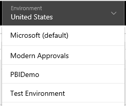
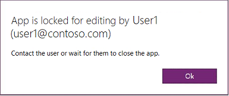

# Bearbeiten einer Canvas-App in PowerApps
Sie können alle Canvas-Apps bearbeiten, die Sie erstellt haben, deren Besitzer Sie sind oder für die Sie die Berechtigung **Kann bearbeiten** haben. Sie können eine App in PowerApps Studio bearbeiten. Wenn Sie versuchen, eine App zu bearbeiten, die an anderer Stelle zur Bearbeitung geöffnet ist, gibt eine Meldung Aufschluss darüber, ob Sie oder ein anderer Benutzer sie bereits geöffnet hat.

## Überprüfen Ihrer Berechtigungen
1. Melden Sie sich bei [PowerApps](https://web.powerapps.com?utm_source=padocs&utm_medium=linkinadoc&utm_campaign=referralsfromdoc) an, und klicken oder tippen Sie im Menü **Datei** auf der linken Seite auf **Apps**.
   
    

2. Klicken oder tippen Sie in der App-Kategorieauswahl auf **Apps, die ich bearbeiten kann**.

    Sie können alle Apps in der angezeigten Liste bearbeiten. Sie können auch nach einer App suchen, indem Sie in das Suchfeld rechts oben ein oder mehrere Zeichen eingeben.

    > [!NOTE]
    > Wenn die App, die Sie bearbeiten möchten, immer noch nicht angezeigt wird, überprüfen Sie rechts oben, ob Sie die richtige Umgebung ausgewählt haben.
   
    

1. Klicken oder tippen Sie für die App, die Sie bearbeiten möchten, auf die Auslassungspunkte (...), und klicken oder tippen Sie anschließend auf **Bearbeiten**.

## Zusammenarbeiten an einer App
Jeder Benutzer mit der Berechtigung **Bearbeiten** für eine App kann diese bearbeiten. Doch die App kann immer nur von einem Benutzer gleichzeitig bearbeitet werden. Wenn Sie versuchen, eine App zu bearbeiten, die bereits von einem anderen Benutzer bearbeitet wird, wird diese Meldung angezeigt. Sie können erst fortfahren, nachdem der andere Benutzer die App geschlossen hat (oder ein Timeout der Sitzung des Benutzers eintritt).

Darüber hinaus wird diese Meldung angezeigt, wenn Sie eine App zur Bearbeitung öffnen und versuchen, sie auf einem anderen Gerät oder in einem anderen Browserfenster zu öffnen. Sie können die vorherige Sitzung überschreiben, aber Sie verlieren möglicherweise alle Änderungen, die Sie nicht gespeichert haben.

## Nächste Schritte
Erfahren Sie mehr dazu, wie Sie einen [Bildschirm](add-screen-context-variables.md), ein [Steuerelement](add-configure-controls.md) oder eine [Datenverbindung](add-data-connection.md) hinzufügen.

