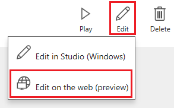

# Bearbeiten einer App in PowerApps
Sie können alle Apps bearbeiten, die Sie erstellt haben, deren Besitzer Sie sind oder für die Sie die Berechtigung **Bearbeiten** haben. Sie können Apps in PowerApps Studio für Web oder in PowerApps Studio für Windows bearbeiten. Wenn Sie versuchen, eine App zu bearbeiten, die an anderer Stelle zur Bearbeitung geöffnet ist, gibt eine Meldung Aufschluss darüber, ob Sie oder ein anderer Benutzer sie bereits geöffnet hat.

## Überprüfen Ihrer Berechtigungen
1. Melden Sie sich bei [PowerApps](https://web.powerapps.com) an, und klicken oder tippen Sie im Menü **Datei** auf der linken Seite auf **Apps**.
   
    
2. Öffnen Sie die App-Kategorieauswahl, und klicken oder tippen Sie auf **Apps, deren Besitzer ich bin** oder **Apps, bei denen ich mitgewirkt habe**.
   
    
   
    Sie können alle Apps in der angezeigten Liste bearbeiten. Sie können auch nach einer App suchen, indem Sie in das Suchfeld rechts oben ein oder mehrere Zeichen eingeben.
   
    > [!NOTE]
> Wenn die App, die Sie bearbeiten möchten, immer noch nicht angezeigt wird, überprüfen Sie rechts oben, ob Sie die richtige Umgebung ausgewählt haben.
   
    

## Bearbeiten einer App in PowerApps Studio für Web
1. Führen Sie die Schritte im vorherigen Verfahren aus, um zur App zu wechseln, die Sie bearbeiten möchten.
2. Klicken oder tippen Sie am rechten Rand auf das Symbol „Info“ der App.
   
    
3. Klicken oder tippen Sie rechts oben auf das Symbol **Bearbeiten** und dann auf **Im Web bearbeiten**.
   
    

## Bearbeiten einer App in PowerApps Studio für Windows
1. Öffnen Sie PowerApps Studio für Windows.
2. Wechseln Sie auf der Seite, die standardmäßig angezeigt wird, zur App, die Sie bearbeiten möchten.
   
    Um eine App leichter zu finden, klicken oder tippen Sie rechts oben auf das Symbol „Suchen“. Geben Sie dann ein oder mehrere Zeichen des Namens der App ein. Sie können auch die Liste nach Name, dem Datum der letzten Änderung oder dem Datum der letzten Öffnung sortieren. Wenn die gewünschte App noch immer nicht angezeigt wird, vergewissern Sie sich, dass Sie in der richtigen PowerApps Umgebung sind (siehe das erste Verfahren).
   
    
3. Klicken oder tippen Sie am rechten Rand auf das Stiftsymbol der App, die Sie bearbeiten möchten.
   
    Sie können alle Apps bearbeiten, deren Stiftsymbol schwarz und nicht grau ist.
   
    

## Zusammenarbeiten an einer App
Jeder Benutzer mit der Berechtigung **Bearbeiten** für eine App kann diese bearbeiten. Doch die App kann immer nur von einem Benutzer gleichzeitig bearbeitet werden. Wenn Sie versuchen, eine App zu bearbeiten, die bereits von einem anderen Benutzer bearbeitet wird, wird diese Meldung angezeigt. Sie können erst fortfahren, nachdem der andere Benutzer die App geschlossen hat (oder ein Timeout der Sitzung des Benutzers eintritt).

Darüber hinaus wird diese Meldung angezeigt, wenn Sie eine App zur Bearbeitung öffnen und versuchen, sie auf einem anderen Gerät oder in einem anderen Browserfenster zu öffnen. Sie können die vorherige Sitzung überschreiben, aber Sie verlieren möglicherweise alle Änderungen, die Sie nicht gespeichert haben.

## Nächste Schritte
Erfahren Sie mehr dazu, wie Sie einen [Bildschirm](add-screen-context-variables.md), ein [Steuerelement](add-configure-controls.md) oder eine [Datenverbindung](add-data-connection.md) hinzufügen.

