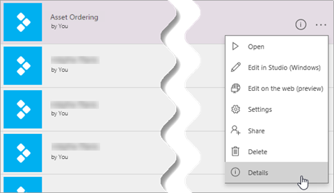

# <a name="integrate-canvas-apps-into-websites-and-other-services"></a>Integrieren von Canvas-Apps in Websites und andere Dienste
Die apps, die Sie erstellen, sind oftmals besonders nützlich, wenn Sie verfügbar sind, wo die Benutzer ihre Arbeit erledigen. Wenn Sie Canvas-apps in einen iframe einbetten, können Sie diese apps in Websites und andere Dienste integrieren, wie z. b. Power BI oder SharePoint.

In diesem Thema zeigen wir das Festlegen von Parametern für die Einbettung von Apps. Anschließend betten wir Ihre App zum Bestellen von Geschäftsausstattung in eine Website ein.


Berücksichtigen Sie die folgenden Einschränkungen:

- Nur powerapps-Benutzer im gleichen Mandanten können auf die eingebettete App zugreifen.
- Wenn Sie mit Internet Explorer 11 auf powerapps zugreifen möchten, müssen Sie die Kompatibilitäts Ansicht deaktivieren.

Sie können Canvas-apps auch ohne Verwendung eines Iframes in SharePoint Online integrieren. Weitere Informationen: [verwenden Sie das powerapps-Webpart](https://support.office.com/article/use-the-powerapps-web-part-6285f05e-e441-408a-99d7-aa688195cd1c).

## <a name="set-uri-parameters-for-your-app"></a>Festlegen von URI-Parametern für Ihre App
Wenn Sie über eine einzubettende App verfügen, besteht der erste Schritt im Festlegen von Parametern für den URI (Uniform Resource Identifier), um dem iframe mitzuteilen, wo sich die App befindet. Der URI liegt in der folgenden Form vor:

```
https://apps.powerapps.com/play/[AppID]?source=iframe
```

> [!IMPORTANT]
> Seit August 2019 hat sich das URI-Format von https://web.powerapps.com/webplayer in https://apps.powerapps.com/play geändert. Aktualisieren Sie alle eingebetteten iFrames, damit das neue URI-Format verwendet wird. Verweise auf das vorherige Format werden an den neuen URI umgeleitet, um die Kompatibilität zu gewährleisten.
>
> Vorheriges Format:
> 
> HTTPS\://Web.powerapps.com/Webplayer/iframeapp? Source = IFRAME & AppID =/Providers/Microsoft.PowerApps/Apps/[AppID]

Sie brauchen nichts weiter zu tun, als die [AppID] im URI durch die ID Ihrer App zu ersetzen (einschließlich von „[' & ']“). Wir zeigen Ihnen in Kürze, wie Sie an diesen Wert gelangen, aber zunächst folgt hier die Auflistung aller im URI verfügbaren Parameter:

* **[AppID]** : gibt die ID der APP an, die ausgeführt werden soll.
* **tenantid** : ein optionaler Parameter, der den Gast Zugriff unterstützt und bestimmt, von welchem Mandanten die APP geöffnet werden soll. 
* **screenColor**: stellt Ihren Benutzern ein besseres Ladeverhalten bereit. Dieser Parameter liegt im Format [RGBA (Rotwert, Grünwert, Blauwert, Alpha)](../canvas-apps/functions/function-colors.md) vor und steuert die Bildschirmfarbe während des Ladens der App. Er sollte auf die gleiche Farbe wie das Symbol Ihrer App festgelegt werden.
* **source**: ohne Auswirkungen auf die App, wir empfehlen Ihnen jedoch, mit einem beschreibenden Namen auf die Quelle für die Einbettung zu verweisen.
* Schließlich können Sie mithilfe der [Param()-Funktion](../canvas-apps/functions/function-param.md) beliebige benutzerdefinierte Parameter hinzufügen, und diese Werte können von Ihrer App verbraucht werden. Sie werden am Ende des URIs hinzugefügt, wie etwa in `[AppID]?source=iframe&param1=value1&param2=value2`. Diese Parameter sind während des Starts der APP schreibgeschützt. Wenn Sie Sie ändern müssen, müssen Sie die APP neu starten. Beachten Sie, dass nur das erste Element nach [AppID] ein "?" enthalten sollte. Verwenden Sie danach das "&", wie hier dargestellt. 

### <a name="get-the-app-id"></a>Abrufen der App-ID
Die App-ID ist auf „powerapps.com“ verfügbar. Führen Sie für die einzubettende App folgende Aktionen aus:

1. Klicken oder tippen Sie in [powerapps.com](https://powerapps.microsoft.com) auf der Registerkarte **Apps** auf die Auslassungspunkte ( **. . .** ) und dann auf **Details**.
   
    
1. Kopieren Sie die **App ID**.
   
    
1. Ersetzen Sie den `[AppID]`-Wert im URI. Für unsere App zum Bestellen von Geschäftsausstattung sieht der URI wie folgt aus:
   
    ```
    https://apps.powerapps.com/play/76897698-91a8-b2de-756e-fe2774f114f2?source=iframe
    ```

## <a name="embed-your-app-in-a-website"></a>Einbetten der App in eine Website
Zum Einbetten Ihrer App brauchen Sie nur den iframe in den HTML-Code Ihrer Website einzufügen (oder in einen anderen Dienst mit iframe-Unterstützung wie Power BI und SharePoint):

```html
<iframe width="[W]" height="[H]" src="https://apps.powerapps.com/play/[AppID]?source=website&screenColor=rgba(165,34,55,1)" allow="geolocation; microphone; camera"/>
```

Geben Sie Werte für die Höhe und Breite des iframes an, und ersetzen Sie `[AppID]` durch die ID Ihrer App.

> [!NOTE]
> Schließen Sie `allow="geolocation; microphone; camera"` in Ihren iframe-HTML-Code ein, damit Ihre Apps diese Funktionen in Google Chrome nutzen können.

Auf dem folgenden Bild sehen Sie die App zum Bestellen von Geschäftsausstattung auf einer Contoso-Beispielwebsite eingebettet.


Beachten Sie hinsichtlich der Authentifizierung von Benutzern Ihrer App die folgenden Punkte:

- Wenn Ihre Website AAD-basierte (Azure Active Directory) Authentifizierung verwendet, ist keine zusätzliche Anmeldung erforderlich.
- Wenn Ihre Website einen anderen Anmeldemechanismus verwendet oder auf Authentifizierung verzichtet, wird Ihren Benutzern eine Anmeldeaufforderung auf dem iframe angezeigt. Nach erfolgter Anmeldung können Ihre Benutzer die App so lange ausführen, wie der Autor der App sie freigegeben hat.

Wie Sie sehen können, ist das Einbetten von Apps ein einfaches und leistungsstarkes Verfahren. Durch Einbetten können Sie Apps direkt dort zur Verfügung stellen, wo Sie und Ihre Kunden arbeiten – auf Websites, Power BI-Dashboards, SharePoint-Seiten und vielem mehr.
