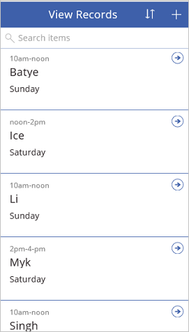
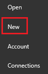
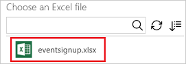
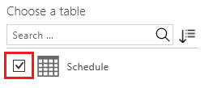
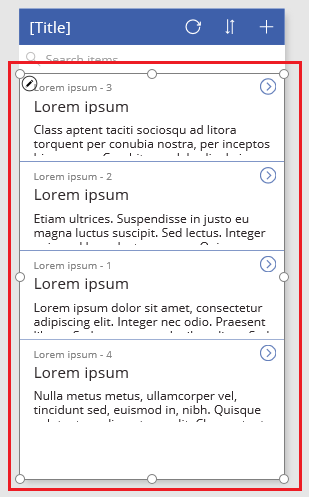
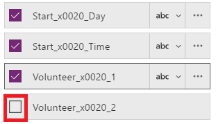
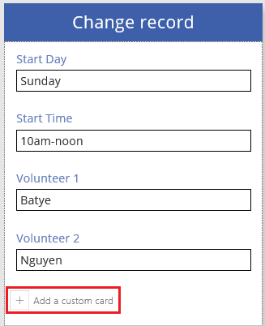
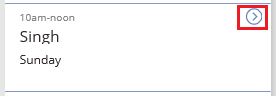

# App von Grund auf neu erstellen
Erstellen Sie Ihre eigene App von Grund auf neu mithilfe einer Vielzahl von Datenquellen, wobei Sie später noch weitere Quellen hinzufügen können, wenn Sie möchten. Geben Sie die Darstellung und das Verhalten jedes UI-Elements so an, dass Sie das Ergebnis für Ihre genauen Ziele und Ihren Workflow optimieren können. Dieser Ansatz ist weitaus zeitaufwendiger als [eine App automatisch zu generieren](get-started-create-from-data.md), aber erfahrene App-Entwickler können die beste App für ihre Anforderungen erstellen.

> [!NOTE]
> Dieses Thema wurde für PowerApps Studio für Windows verfasst, die Schritte sind jedoch ähnlich, wenn Sie [PowerApps in einem Browser öffnen](create-app-browser.md).

Mithilfe dieses Tutorials können Sie eine App erstellen, die zwei Bildschirme enthält. Auf einem Bildschirm können Benutzer eine Reihe von Datensätzen durchsuchen:

Auf dem anderen Bildschirm können Benutzer einen Datensatz erstellen, ein oder mehrere Felder in einem Datensatz aktualisieren oder einen vollständigen Datensatz löschen:

## Voraussetzungen
Sie können dieses Tutorial zur allgemeinen Information verwenden oder den hier aufgeführten Schritten exakt folgen.

1. Kopieren Sie diese Daten, und fügen Sie sie in eine Excel-Datei ein.

   | Start Day | Start Time | Volunteer 1 | Volunteer 2 |
   | --- | --- | --- | --- |
   | Saturday |10am-noon |Vasquez |Kumashiro |
   | Saturday |noon-2pm |Ice |Singhal |
   | Saturday |2pm-4-pm |Myk |Mueller |
   | Sunday |10am-noon |Li |Adams |
   | Sunday |10am-noon |Singh |Morgan |
   | Sunday |10am-noon |Batye |Nguyen |

2. Formatieren Sie diese Daten als Tabelle mit dem Namen **Schedule**, sodass die Informationen von PowerApps analysiert werden können.

    Weitere Informationen finden Sie unter [Erstellen oder Löschen einer Excel-Tabelle](https://support.office.com/article/Create-an-Excel-table-in-a-worksheet-E81AA349-B006-4F8A-9806-5AF9DF0AC664).

3. Speichern Sie die Datei unter dem Namen **eventsignup.xls**, und laden Sie sie dann in ein [Cloud-Speicherkonto](connections/cloud-storage-blob-connections.md) wie z.B. OneDrive hoch.

4. Wenn Sie mit PowerApps nicht vertraut sind:

   * Erfahren Sie, wie Sie [ein Steuerelement hinzufügen und seine Eigenschaften festlegen](add-configure-controls.md), die bestimmen, wie das Steuerelement angezeigt wird und sich verhält.
   * Erfahren Sie, wie Sie [einen Bildschirm hinzufügen und umbenennen](add-screen-context-variables.md).

## Erstellen einer leeren App und Verbinden mit Daten
1. Klicken oder tippen Sie in PowerApps Studio am linken Rand des Bildschirms im Menü **File** (Datei) auf **New** (Neu).

    

2. Klicken oder tippen Sie in der Kachel **Leere App** auf **Telefonlayout**.

    

3. Wenn Sie dazu aufgefordert werden, folgen Sie der Einführung, um die Hauptbereiche von PowerApps kennenzulernen (oder klicken oder tippen Sie auf **Skip** (Überspringen)).

    

    Sie können sich die Einführung jederzeit später anschauen. Klicken oder tippen Sie hierzu auf das Fragezeichensymbol in der Nähe der oberen rechten Ecke des Bildschirms, und klicken oder tippen Sie anschließend auf **Take the intro tour** (Einführung).

4. Klicken oder tippen Sie auf der linken Navigationsleiste rechts unten auf ein Symbol, um zur Miniaturansicht zu wechseln.

    

5. Klicken oder tippen Sie im rechten Bereich auf **Datenquelle hinzufügen**.

    

6. Führen Sie einen der folgenden Schritte aus:

   * Wenn bereits eine Verbindung mit Ihrem Cloudspeicherkonto besteht, klicken oder tippen Sie darauf.
   * Wenn keine Verbindung mit Ihrem Cloudspeicherkonto besteht, klicken oder tippen Sie auf **Add Connection** (Verbindung hinzufügen), klicken oder tippen Sie auf **Connect** (Verbinden), und geben Sie anschließend Ihre Anmeldeinformationen an, wenn Sie dazu aufgefordert werden.

7. Navigieren Sie unter **Choose an Excel file** (Eine Excel-Datei auswählen) zu **eventsignup.xlsx**, und klicken oder tippen Sie darauf.

    

8. Klicken Sie unter **Choose a table** (Eine Tabelle auswählen) auf das Kontrollkästchen **Schedule** (Zeitplan), und klicken oder tippen Sie auf **Connect**.

    

    Die Registerkarte **Data sources** (Datenquellen) im rechten Bereich zeigt an, welche Datenquellen Sie Ihrer App hinzugefügt haben.

    

    Dieses Tutorial erfordert nur eine Datenquelle, Sie können jedoch später weitere Datenquellen hinzufügen.

## Anzeigen der Daten
1. Klicken oder tippen Sie auf der Registerkarte **Start** auf **Neuer Bildschirm**, und klicken oder tippen Sie dann auf **Bildschirmliste**.

    

    Es wird ein Bildschirm mit mehreren Standardsteuerelementen hinzugefügt, wie etwa einem Suchfeld und einem **[Katalog](controls/control-gallery.md)**-Steuerelement. Der Katalog deckt den gesamten Bildschirm unter dem Suchfeld ab.

2. Klicken oder tippen Sie an einer beliebigen Position im Katalog – mit Ausnahme der Pfeile – z. B. direkt unterhalb des Suchfelds.

    

3. Öffnen Sie im rechten Bereich die Liste **Layouts**, und klicken oder tippen Sie dann auf die Option, die nur einen Titel, einen Untertitel und einen Textkörper anzeigt.

    

4. Klicken oder tippen Sie in der Eigenschaftenliste auf **[Items](controls/properties-core.md)** (Elemente), kopieren Sie diese Formel, und fügen Sie sie in die Bearbeitungsleiste ein:

    **SortByColumns(Search(Schedule, TextSearchBox1.Text, "Volunteer_x0020_1"), "Volunteer_x0020_1", If(SortDescending1, SortOrder.Descending, SortOrder.Ascending))**

    Wenn Sie nicht sicher sind, wo sich die Eigenschaftenliste befindet, erfahren Sie dies unter [Hinzufügen und Konfigurieren von Steuerelementen](add-configure-controls.md).

    > [!NOTE]
> PowerApps zeigt für Excel- oder SharePoint-Datenquellen, die Spaltennamen mit Leerzeichen enthalten, die Leerzeichen als **"\_X0020\_"** an. In diesem Beispiel wird die Spalte **"Volunteer 1"** in einer Formel als **"Volunteer_x0020_1"** angezeigt.

    Dieser Katalog zeigt die Daten aus der Tabelle **Schedule** an.

    

    Mithilfe des Suchfelds kann im Katalog basierend auf dem Text, den der Benutzer eingibt, gefiltert werden. Wenn ein Benutzer mindestens einen Buchstaben in das Suchfeld eingibt, zeigt der Katalog nur die Datensätze an, bei denen das Feld **Volunteer 1** den Text enthält, den der Benutzer eingibt.

    Mithilfe der Sortierschaltfläche können die Datensätze basierend auf Daten in der Spalte **Volunteer 1** sortiert werden. Wenn ein Benutzer auf diese Schaltfläche klickt oder tippt, wechselt die Sortierreihenfolge zwischen aufsteigend und absteigend hin und her.

    Diese Formel enthält die Funktionen **Sort**, **If**, **IsBlank**, **Filter** und **Text**. Weitere Informationen zu diesen und anderen Funktionen finden Sie unter [formula reference (Formelreferenz)](formula-reference.md).

5. Geben Sie ein **i** in das Suchfeld ein, und klicken oder tippen Sie einmal (oder eine ungerade Anzahl von Malen) auf die Sortierschaltfläche.

    Der Katalog zeigt diese Ergebnisse an.

    

    Weitere Informationen zu den Funktionen **[Sort](functions/function-sort.md)** (Sortieren), **[Filter](functions/function-filter-lookup.md)** (Filtern) und [weiteren Funktionen](formula-reference.md)

6. Wählen Sie das **[Label](controls/control-text-box.md)**-Steuerelement (Bezeichnung) oben auf dem Bildschirm aus, indem Sie auf das Steuerelement klicken oder tippen.

    

7. Klicken oder tippen Sie in der Eigenschaftenliste auf **[Text](controls/properties-core.md)**, kopieren Sie diesen Text, und fügen Sie ihn in die Bearbeitungsleiste ein. 
   **„View Records“**

    

## Erstellen des ChangeScreen und dessen Banner
1. Löschen Sie **Screen1**, und benennen Sie **Screen2** in **ViewScreen** um.

    

2. Fügen Sie einen Bildschirm hinzu, und benennen Sie ihn in **ChangeScreen** um.

    

3. Klicken oder tippen Sie auf der Registerkarte **Einfügen** auf **Text** und anschließend auf **[Bezeichnung](controls/control-text-box.md)**.

4. Konfigurieren Sie das **Label**-Steuerelement (Bezeichnung), das Sie soeben hinzugefügt haben:

   * Legen Sie die **Text**-Eigenschaft auf diese Formel fest:
      **„Change record“**

   * Legen Sie die **Fill**-Eigenschaft auf diese Formel fest:
      **RGBA(62, 96, 170, 1)**.

   * Legen Sie die **Color**-Eigenschaft auf diese Formel fest:
      **RGBA(255, 255, 255, 1)**

   * Legen Sie die **Align**-Eigenschaft auf **Center** fest.
   * Legen Sie die **X**-Eigenschaft auf **0** fest.

   * Legen Sie die **Width**-Eigenschaft auf **640** fest.
     Das **Label** -Steuerelement (Bezeichnung) spiegelt Ihre Änderungen wider.

     

## Ein Formular hinzufügen und konfigurieren
1. Klicken oder tippen Sie auf der Registerkarte **Insert** (Einfügen) auf **Forms** (Formulare) und anschließend auf **Edit** (Bearbeiten).

2. Verschieben Sie das Formular bzw. ändern Sie dessen Größe so, dass es den Großteil des Bildschirms überdeckt.

    

    Das Formular hat standardmäßig die Benennung **Form1**, sofern Sie nicht bereits ein Formular hinzugefügt und wieder entfernt haben. Benennen Sie in diesem Fall das Formular in **Form1** um.

3. Legen Sie die **[DataSource](controls/control-form-detail.md)**-Eigenschaft von **Form1** auf **Schedule** fest.

4. Legen Sie die **Item**-Eigenschaft von **Form1** auf diesen Ausdruck fest:
    **BrowseGallery1.Selected**

5. Klicken oder tippen Sie im rechten Bereich auf das Kontrollkästchen jedes Felds, um es anzuzeigen.

    

6. Klicken oder tippen Sie unten auf dem Formular auf **Benutzerdefinierte Karte hinzufügen**.

    

7. Fügen Sie ein **[Label](controls/control-text-box.md)**-Steuerelement (Bezeichnung) zu der neuen Karte hinzu.

8. Legen Sie die **[AutoHeight](controls/control-text-box.md)**-Eigenschaft des neuen Steuerelements auf **TRUE** und die **[Text](controls/properties-core.md)**-Eigenschaft auf die folgende Formel fest:
    **Form1.Error**

    Die Bezeichnung zeigt alle Fehlermeldungen aus dem Formular an.

9. Klicken oder tippen Sie in der linken Navigationsleiste auf die Miniaturansicht für den **ChangeScreen**, um diesen auszuwählen.

10. Klicken oder tippen Sie auf der Registerkarte **Insert** (Einfügen) auf **Icons** (Symbole) und dann auf die Option zum Hinzufügen eines **Rückwärtspfeils**, und verschieben Sie dann den Pfeil in die linke untere Ecke des Bildschirms.

11. Legen Sie die **[OnSelect](controls/properties-core.md)**-Eigenschaft des Pfeils auf diese Formel fest:

     **ResetForm(Form1);Navigate(ViewScreen,ScreenTransition.None)**

      Wenn der Benutzer auf den Pfeil klickt oder tippt, öffnet die **[Navigate](functions/function-navigate.md)**-Funktion den **ViewScreen**.

12. Fügen Sie ein Steuerelement **[Button](controls/control-button.md)** (Schaltfläche) unterhalb des Formulars hinzu, und legen Sie die **[Text](controls/properties-core.md)**-Eigenschaft auf **„Save“** fest.

     

13. Legen Sie die Eigenschaft **[OnSelect](controls/properties-core.md)** der Schaltfläche auf die folgende Formel fest:

    **SubmitForm(Form1); If(Form1.ErrorKind = ErrorKind.None, Navigate(ViewScreen, ScreenTransition.None))**

    Wenn der Benutzer auf die Schaltfläche klickt oder tippt, speichert die Funktion **[SubmitForm](functions/function-form.md)** (Formular absenden) alle Änderungen an der Datenquelle, und der **ViewScreen** wird erneut angezeigt.

14. Fügen Sie unten auf dem Bildschirm eine weitere Schaltfläche hinzu, legen Sie deren **[Text](controls/properties-core.md)**-Eigenschaft auf **„Remove“** und deren Eigenschaft **[OnSelect](controls/properties-core.md)** auf die folgende Formel fest:

    **Remove(Schedule,BrowseGallery1.Selected); If(IsEmpty(Errors(Schedule)),Navigate(ViewScreen,ScreenTransition.None))**

    Wenn der Benutzer auf diese Schaltfläche klickt oder tippt, entfernt die Funktion **[Remove](functions/function-remove-removeif.md)** (Entfernen) den Datensatz, und der **ViewScreen** wird erneut angezeigt.

15. Legen Sie die Eigenschaft **[Visible](controls/properties-core.md)** der Schaltfläche **Remove** (Entfernen) auf die folgende Formel fest:
     **Form1.Mode=FormMode.Edit**

    Dieser Schritt blendet die Schaltfläche **Remove** (Entfernen) aus, wenn der Benutzer einen Datensatz erstellt.

    Der **ChangeScreen** entspricht diesem Beispiel:

    

## Festlegen der Navigation auf dem ViewScreen
1. Klicken oder tippen Sie in der linken Navigationsleiste auf die Miniaturansicht für den **ViewScreen**.

    

2. Klicken oder tippen Sie beim ersten Datensatz im Katalog auf den Pfeil **Next** (Weiter).

    

3. Legen Sie die Eigenschaft **[OnSelect](controls/properties-core.md)** des Pfeils auf die folgende Formel fest:

    **Navigate(ChangeScreen,ScreenTransition.None)**

4. Klicken oder tippen Sie in der oberen rechten Ecke auf das Pluszeichen.

    

5. Legen Sie die Eigenschaft **[OnSelect](controls/properties-core.md)** des ausgewählten Symbols auf die folgende Formel fest:

    **NewForm(Form1);Navigate(ChangeScreen,ScreenTransition.None)**`

     Wenn der Benutzer auf dieses Symbol klickt oder tippt, wird der **ChangeScreen** angezeigt, wobei jedes Feld leer ist, damit der Benutzer einen Datensatz einfacher erstellen kann.

## Ausführen der App
Während Sie die App anpassen, testen Sie Ihre Änderungen, indem Sie die App im Vorschaumodus ausführen, wie in den Schritten dieses Abschnitts beschrieben.

1. Klicken oder tippen Sie in der linken Navigationsleiste auf die obere Miniaturansicht, um den **ViewScreen** auszuwählen.

    

2. Öffnen Sie den Vorschaumodus durch Drücken von F5 (oder durch Klicken oder Tippen auf das Symbol **Preview** (Vorschau) in der Nähe der oberen rechten Ecke).

    

3. Klicken oder tippen Sie auf den Pfeil „Next“ bei einem Datensatz, um Details zu diesem Datensatz anzuzeigen.

4. Ändern Sie auf dem **ChangeScreen** die Informationen in mindestens einem Feld, und speichern Sie Ihre Änderungen anschließend, indem Sie auf **Save** (Speichern) klicken oder tippen, oder entfernen Sie den Datensatz, indem Sie auf **Remove** (Entfernen) klicken oder tippen.

5. Schließen Sie den Vorschaumodus, indem Sie die ESC-TASTE drücken (oder indem Sie auf das Schließen-Symbol unter der Titelleiste klicken oder tippen).

    

## Nächste Schritte
* Drücken Sie STRG+S, um Ihre App in der Cloud zu speichern, sodass Sie sie auf anderen Geräten ausführen können.
* Sie können die [App freigeben](share-app.md), damit sie von anderen Personen ausgeführt werden kann.
* Erfahren Sie mehr über [Kataloge](add-gallery.md), [Formulare](add-form.md) und [Formeln](working-with-formulas.md).
