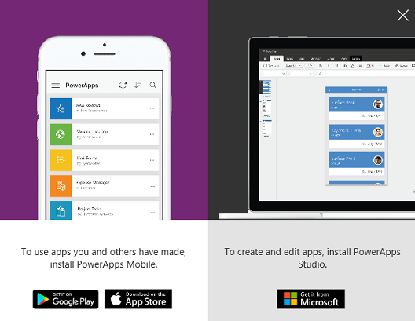
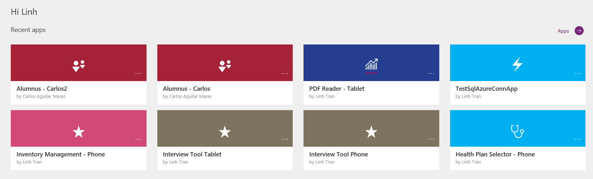
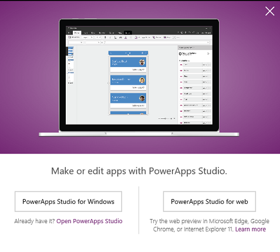
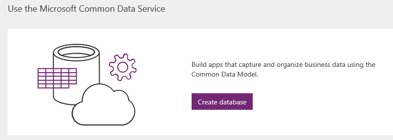

# Einführung in powerapps.com
Das PowerApps-Team stellt [powerapps.com](http://web.powerapps.com) als neue Anlaufstelle für App-Entwickler vor. Wir haben die Seite als Hauptwebsite für Entwickler neu entworfen; hier können sie mühelos mit der Entwicklung von Apps beginnen, von Microsoft Common Data Service profitieren und ihre Apps alle an der gleichen Stelle verwalten. In diesem Artikel erkläre ich Ihnen Folgendes:

* den Header
* die Startseite
* die Seite **Apps**

## Header
Wenn Sie sich registrieren und sich zum ersten Mal auf powerapps.com anmelden, bemerken Sie den neuen Header der Website. Am linken Rand des Headers befindet sich das Office-Symbol. Über dieses Symbol haben Sie schnellen Zugriff auf alle anderen Office Produkte, wie z.B. PowerPoint, OneNote und Word sowie Microsoft Flow und Dynamics 365.

Am rechten Rand des Headers wird ein Dropdownfeld für die Umgebung angezeigt, über das Sie schnell zwischen Umgebungen wechseln können. Sehr wahrscheinlich ist die **Standardumgebung** standardmäßig ausgewählt. [Erfahren Sie mehr über Umgebungen](../../administrator/environments-overview.md).

Neben dem Dropdownfeld für die Umgebung befindet sich ein Downloadsymbol. Klicken oder tippen Sie auf dieses Symbol, und es öffnet sich ein Dialogfeld mit Links zum Herunterladen von PowerApps Mobile (für iOS- oder Android-Geräte).

Neben dem Downloadsymbol befindet sich ein Zahnradsymbol für die Einstellungen. Klicken oder tippen Sie auf dieses Symbol, und es werden Links für Verbindungen, Gateways sowie zum Admin Center angezeigt.

Neben den Einstellungen befindet sich ein Fragezeichensymbol, das Sie zum Hilfebereich führt. Klicken oder tippen Sie auf dieses Symbol, und es werden Links zum geführten Lernen, der Dokumentation, dem Support, der Community, den Blogs und zu rechtlichen Hinweisen und Datenschutz angezeigt.

## Die Startseite
Nach der Anmeldung auf [powerapps.com](http://web.powerapps.com) befinden Sie sich standardmäßig auf der Startseite. Wir haben den Aufbau der Startseite angepasst, sodass Sie schnell mit der Arbeit anfangen können – egal, ob Sie eine App erstellen oder Common Data Service erkunden möchten.

Wenn Sie sich schon einmal in PowerApps angemeldet haben und einige Apps erstellt bzw. ausgeführt haben, ist der erste Bereich auf Ihrer Startseite die Liste **Recent apps** (Zuletzt verwendete Apps). Sie sind nach dem Datum Ihres letzten Gebrauchs sortiert.

In der rechten oberen Ecke befindet sich ein Pfeil mit der Beschriftung **Apps**, der direkt auf die Seite **Apps** verlinkt, sodass Sie alle Ihre Apps anzeigen können.

Wenn Sie sich noch nie angemeldet, eine App erstellt oder ausgeführt haben, wird der Bereich **Recent Apps** (Zuletzt verwendete Apps) nicht angezeigt. Stattdessen sehen Sie das Banner **Create an App** (App erstellen).

Klicken oder tippen Sie auf dem Banner auf **Get started** (Los geht‘s), und es werden Ihnen Optionen zum Erstellen einer App mit **PowerApps Studio** angezeigt.

Neben **Get started** (Los geht‘s) befinden sich unsere Tutorialvideos zum schnellen Erstellen einer App mithilfe von Daten (entweder in SharePoint oder PowerApps) und der anschließenden Freigabe dieser App. Wenn Sie auf den Pfeil **Learn more** (Mehr erfahren) klicken, gelangen Sie zu einem Thema, dass Ihnen erklärt, wie Sie eine App mit bereits vorhandenen Daten erstellen.

Unterhalb des Banners **Create an app** (Erstellen einer App) befindet sich das Banner **Use the Microsoft Common Data Service** (Microsoft Common Data Service verwenden).

Unter **Common Data Service** wird eine andere Schaltfläche angezeigt, je nach Ihrer Lizenz oder Berechtigung.

* Wenn die Schaltfläche **Start trial** (Testversion starten) angezeigt wird, haben Sie keine P2-Lizenz für PowerApps, die aber für Common Data Service erforderlich ist. Klicken oder tippen Sie auf diese Schaltfläche, um die Seite zu öffnen, auf der Sie sich für eine kostenlose, 90-tägige Testversion dieser Lizenz registrieren können. [Mehr Informationen zu PowerApps-Lizenzen](../signup-for-powerapps.md).
* Wenn die Schaltfläche **Get started** (Los geht‘s) angezeigt wird, befinden Sie sich in einer Umgebung, die keine Common Data Service-Datenbank besitzt oder auf die Sie keinen Zugriff haben. Klicken oder tippen Sie auf diese Schaltfläche, um gleichzeitig eine Umgebung und eine Datenbank zu erstellen, damit Sie Common Data Services für Ihre Apps verwenden können. [Weitere Informationen zum Erstellen von Umgebungen](../../administrator/environments-administration.md).
  
    
  
    Wenn Sie keine Umgebung erstellen möchten, können Sie jederzeit zu einer Umgebung wechseln, auf die Sie Zugriff haben.
* Wenn die Schaltfläche **Create Database** (Datenbank erstellen) angezeigt wird, befinden Sie sich in einer Umgebung, die keine Common Data Service-Datenbank besitzt; Sie haben allerdings Berechtigung, dort eine Datenbank zu erstellen.
  
    
  
    Klicken oder tippen Sie auf diese Schaltfläche, und es wird eine Datenbank für diese Umgebung bereitgestellt.
  
    
* Wenn die Schaltfläche **Browse entities** (Entitäten durchsuchen) angezeigt wird, befinden Sie sich in einer Umgebung, der bereits eine Common Data Service-Datenbank bereitgestellt wurde und Sie haben Zugriff darauf. Klicken oder tippen Sie auf die Schaltfläche, und die **Entitäten**-Seite wir geöffnet.
  
    

Unterhalb des Banners **Use the Microsoft Common Data Services** (Microsoft Data Service verwenden) befindet sich eine Reihe von Beispiel-Apps und verbundene Beispiel-Apps, die wir für Sie erstellt haben.

* **Beispiel-Apps**: Beispiel-Apps wurden für verschiedene Geschäftsszenarios für das Smartphone- oder Tablet-Layout entwickelt. Klicken Sie auf eine App, um schnell zu einer Beschreibung des Zwecks der App zu kommen, für welches Layout die App entwickelt wurde und welche Funktionen die App vorstellt, wie z.B. Kamera, GPS oder Optionsfelder. Dies ist eine schnelle Möglichkeit für neue Benutzer, einen Überblick über die Funktionen von PowerApps zu erhalten. Sie können eine Vorlage verwenden, um in PowerApps Studio eine identische App zu erstellen.
  
    
* **Verbundene Beispiel-Apps**: Diese Apps stellen eine Verbindung mit Ihren Daten über eine Datenverbindung her, z.B. Office 365, Salesforce, Trello und Wunderlist. Diese Gruppe von Apps unterscheidet sich von den oben genannten Beispiel-Apps. Wenn Sie auf eine verbundene Beispiel-App klicken oder tippen, stellen Sie eigentlich eine neue Instanz der App bereit (wie eine Vorlage). Sie fordert Sie zur Eingabe Ihrer Anmeldeinformationen auf, um eine Verbindung mit Ihren Daten herstellen. Das Schöne an einer verbundenen Beispiel-App ist, dass eine Instanz genau dort für Sie bereitgestellt wird; Sie können sie in PowerApps-Studio öffnen, um zu erfahren, wie die entsprechende App erstellt wurde. Der Nachteil ist, dass das Erstellen ziemlich lange dauern kann (bis zu einer Minute). Haben Sie deshalb bitte Geduld, und erlauben Sie das Öffnen des Browsers, wenn Sie auf eine verbundene Beispiel-App klicken oder tippen.
  
    

## Die Seite "New apps" (Neue Apps)
Sie können über die linke Navigationsleiste auf [powerapps.com](http://web.powerapps.com) auf die **Apps**-Seite zugreifen.

Auf der **Apps**-Seite hatten Sie in der Vergangenheit immer die Wahl zwischen der Kachel- und der Listenansicht. Nach dem 26. Oktober 2016 wird nur noch die Listenansicht unterstützt.

Bitte beachten Sie, dass die Listenansicht nur Apps in der ausgewählten Umgebung anzeigt. Wechseln Sie mit dem Umgebungsfeld im Header in die eine andere Umgebung, um Apps dieser Umgebung anzuzeigen. [Weitere Informationen zum Wechseln von Umgebungen](working-with-environments.md).

## Neuerungen

* Wenn Sie auf eine App klicken oder tippen, wird diese in PowerApps Studio in einer neuen Registerkarte geöffnet.
* Standardmäßig zeigt die **Apps**-Seite alle Apps an, die Sie bearbeiten dürfen. Wählen Sie den Filter **All apps** (Alle Apps) aus, um **All Apps** (Alle Apps) anzuzeigen (einschließlich der Apps, die Sie nur verwenden dürfen).
  
   

Außerdem gibt es:

* **Apps, die ich verwenden kann**, womit alle Apps aufgelistet werden, die für Sie mit User-Berechtigungen freigegeben wurden. Beachten Sie, dass Sie diese Apps auch in [Dynamics 365](http://home.dynamics.com) erwerben können.
* **Apps, die ich besitze**, womit alle Apps aufgelistet werden, die Sie erstellt haben
* **Apps, zu denen ich beitrage**, womit alle Apps aufgelistet werden, die mit Contributor-Berechtigung für Sie freigegeben wurden
* **Beispiel-Apps**, womit alle Beispiel-Apps aufgelistet werden (keine verbundenen Beispiel-Apps)

Wenn Sie auf den Infokreis klicken oder tippen, öffnet sich die Seite "App-Details".

Wenn Sie auf die drei Punkte in einer App klicken, werden Optionen wie „Abspielen“, „Bearbeiten“, „Freigeben“ und „Details“ angezeigt.

Das sind die Hauptänderungen auf powerapps.com, das auf App-Entwickler ausgerichtet ist. Wir hoffen, dass dies Ihnen hilft. Posten Sie einen Kommentar, was Sie bis jetzt gut finden und was wir verbessern können. Wir freuen uns über Ihr Feedback!

