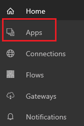

# Wiederherstellen der vorherigen Version einer Canvas-App in PowerApps
In diesem Artikel erfahren Sie, wie Sie eine Canvas-App auf eine frühere Version wiederherstellen, die von Ihrem PowerApps-Konto in der Cloud gespeichert wurde.

## Wiederherstellen einer App von Ihrem Konto
1. Öffnen Sie [powerapps.com](https://make.powerapps.com?utm_source=padocs&utm_medium=linkinadoc&utm_campaign=referralsfromdoc), und klicken oder tippen Sie in der linken Navigationsleiste auf **Apps**.

    

2. (optional) Filtern Sie in der oberen linken Ecke die Liste der Apps, um nur die Apps anzuzeigen, die Sie besitzen oder zu denen Sie beitragen.

    

    > [!NOTE]
   > Wenn die App, die Sie wiederherstellen möchten, nicht angezeigt wird, vergewissern Sie sich, dass Sie sich in der richtigen Umgebung befinden.

3. Klicken oder tippen Sie am rechten Rand auf das Info-Symbol der App, die Sie wiederherstellen möchten.

    

4. Klicken oder tippen Sie auf die Registerkarte **Versionen** und dann für die Version, die Sie wiederherstellen möchten, auf **Wiederherstellen**.

    

5. Klicken oder tippen Sie im Bestätigungsdialogfeld auf **Wiederherstellen**.  

    Der Liste wird eine neue Version hinzugefügt.

    

## Weitere Ressourcen
[Eine App freigeben](share-app.md)  
[App-Name und -Kachel ändern](set-name-tile.md)  
[Eine App löschen](delete-app.md)
