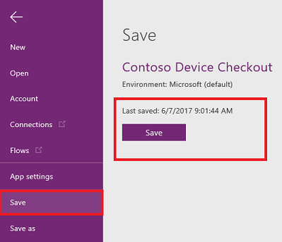
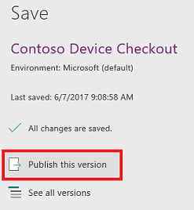

# Speichern und Veröffentlichen einer App in PowerApps
Wenn Sie Änderungen an einer App speichern, veröffentlichen Sie diese automatisch nur für sich selbst und andere Benutzer, die über Berechtigungen zum Bearbeiten der App verfügen. Wenn Sie die Änderungen abgeschlossen haben, müssen Sie sie explizit veröffentlichen, um sie allen Benutzern zur Verfügung zu stellen, für die die App freigegeben ist.

Informationen zum Freigeben einer App finden Sie unter [Freigeben einer App](share-app.md).

## Speichern von Änderungen an einer App
Klicken oder tippen Sie in PowerApps Studio im Menü **Datei** (auf der linken Seite) auf **Speichern**, und führen Sie dann einen der folgenden Schritte aus:

* Wenn Sie die App zuvor noch nicht gespeichert haben, geben Sie einen Namen für sie ein, und klicken oder tippen Sie auf **Speichern**.

    
* Wenn die App schon gespeichert wurde, klicken oder tippen Sie auf **Speichern**.  

    

Die App kann auch automatisch alle 2 Minuten von PowerApps gespeichert werden. Wenn Sie die App einmal gespeichert haben, speichert PowerApps anschließend regelmäßig eine Version der App, ohne dass der Benutzer auf „Speichern“ klicken oder tippen muss. Autoren können im Menü **Datei** auf der Registerkarte **Konto** die Einstellung **Automatisch speichern** aktivieren oder deaktivieren.

## Veröffentlichen einer App
1. Klicken oder tippen Sie in PowerApps Studio im Menü **Datei** (auf der linken Seite) auf **Speichern** und dann auf **Diese Version veröffentlichen**.

    
2. Tippen oder klicken Sie im Dialogfeld **Veröffentlichen** auf **Diese Version veröffentlichen**, um die App für alle Benutzer zu veröffentlichen, für die die App freigegeben ist.

   

   > [!NOTE]
> Es wird empfohlen, dass Sie die App innerhalb von sechs Monaten seit der letzten Veröffentlichung aktualisieren, damit sie mit der neuesten Version von PowerApps synchronisiert wird. Wenn Sie sie nicht innerhalb von sechs Monaten aktualisieren und/oder erneut veröffentlichen, kann es sein, dass die App ohne Vorwarnung nicht mehr funktioniert.

## Bestimmen der Liveversion
Klicken oder tippen Sie auf [powerapps.com](https://web.powerapps.com) im Menü **Datei** (auf der linken Seite) auf **Apps**, dann auf das Symbol „Details“ einer App und schließlich auf die Registerkarte **Versionen**.

Die **Liveversion** wird für alle Benutzer veröffentlicht, für die die App freigegeben ist. Die neueste Version einer App ist nur für diejenigen verfügbar, die über Berechtigungen zum Bearbeiten der App verfügen.

Um die neueste Version zu veröffentlichen, klicken oder tippen Sie auf **Diese Version veröffentlichen** und dann im Dialogfeld **Veröffentlichen** auf **Diese Version veröffentlichen**.

## Nächste Schritte
* [Umbenennen einer App](set-name-tile.md) auf powerapps.com.
* [Wiederherstellen einer App](restore-an-app.md), wenn Sie mehrere Versionen einer App haben.
