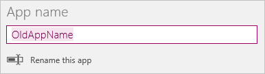
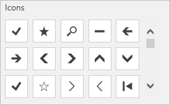

# Ändern des App-Namens und des Symbols in PowerApps
Anpassen einer App durch Ändern des Namens und der Kachel

## Voraussetzungen
1. Erstellen Sie eine App, oder öffnen Sie eine App zum Bearbeiten.

2. Klicken oder tippen Sie im Menü **Datei** auf **App settings** (App-Einstellungen).

## Umbenennen einer App
Klicken oder tippen Sie unter **App-Name** auf **Rename this app** (Diese App umbenennen), und geben Sie einen anderen Namen ein.

## Ändern einer App-Kachel
Befolgen Sie mindestens einen der folgenden Schritte:

* Klicken oder tippen Sie in der Liste der Optionen auf eine andere Hintergrundfarbe.

    

* Klicken oder tippen Sie in der Liste der Standardsymbole auf ein Symbol.

    

* Klicken oder tippen Sie auf **Browse file** (Datei suchen), klicken oder tippen Sie auf das Bild, das Sie verwenden möchten, und klicken oder tippen Sie dann auf **Öffnen**.

    > [!NOTE]
> Verwenden Sie für optimale Ergebnisse ein quadratisches Symbol.

## Nächster Schritt
Klicken oder tippen Sie im Menü **Datei** auf **Speichern**, um Ihre App mit den neuen Einstellungen erneut zu veröffentlichen.

## Weitere Ressourcen
* [Eine App freigeben](share-app.md)
* [Eine App löschen](delete-app.md)
* [Wiederherstellen der vorherigen Version einer App](restore-an-app.md)
