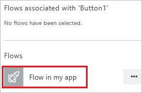
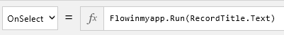

# Starten eines Flows in einer Canvas-App

Mit Microsoft Flow können Sie eine Logik erstellen, die mindestens eine Aufgabe ausführt, wenn ein Ereignis in einer Canvas-App auftritt. Sie können zum Beispiel eine Schaltfläche so konfigurieren, dass bei Auswahl durch den Benutzer ein Element in einer SharePoint-Liste erstellt wird, eine E-Mail oder eine Besprechungsanfrage gesendet wird, eine Datei der Cloud hinzugefügt wird oder all dies ausgeführt wird. Sie können jedes Steuerelement in der App für das Starten des Flows konfigurieren, der auch weiterhin ausgeführt wird, wenn Sie PowerApps schließen.

> [!NOTE]
> Wenn ein Benutzer einen Flow aus einer APP heraus ausführt, muss dieser Benutzer über die Berechtigung zum Ausführen der im Flow angegebenen Tasks verfügen. Andernfalls schlägt der Flow fehl.

## Voraussetzungen

- [Registrieren Sie sich](../signup-for-powerapps.md) bei PowerApps.
- Erfahren Sie, wie Sie ein [Steuerelement konfigurieren](add-configure-controls.md).

## Erstellen eines Flows

1. Melden Sie sich bei [PowerApps](http://web.powerapps.com?utm_source=padocs&utm_medium=linkinadoc&utm_campaign=referralsfromdoc) an.

1. Wählen Sie in der linken Navigationsleiste **Geschäftslogik**aus, und wählen Sie dann **Flows**aus.

1. Wählen Sie in der linken oberen Ecke der Seite " **meine Flows** " die Option **neu**aus, und wählen Sie dann ohne Vorlage **erstellen aus**.

    

1. Wählen Sie am unteren Rand der Seite, die angezeigt wird, die Option **Hunderte von Verbindungen und Triggern durchsuchen**aus.

1. Geben Sie im Suchfeld **powerapps**ein, und wählen Sie dann das **powerapps** -Symbol aus.

    
    
1. Wählen Sie auf der nächsten Seite das powerapps-Symbol erneut aus, und wählen Sie dann **neuer Schritt**aus.

1. Geben Sie im Feld mit den **Connectors und Aktionen suchen**eine Aktion für den Flow an, wie in diesem Beispiel:

   1. Geben Sie in das Feld **SharePoint** ein, und wählen Sie dann in der Liste unter **Aktionen**die Option **Element erstellen** aus.

       

   1. Geben Sie, wenn Sie dazu aufgefordert werden, die Anmeldeinformationen für die Verbindung mit SharePoint an.

   1. Geben oder fügen Sie in das Feld **Websiteadresse** die URL einer SharePoint Online-Website ein, die eine Liste enthält.

       > [!NOTE]
       > Fügen Sie den Namen der Liste nicht an die URL an.

   1. Geben Sie im Feld **Listen Name** die Liste an, die Sie verwenden möchten.
   
       

   1. Wählen Sie das Eingabefeld für ein Feld in der Liste (z. b. **Titel**) aus, wählen Sie im Bereich dynamischer Inhalt die Option **Weitere** anzeigen aus, und wählen Sie dann **in powerapps Fragen**aus. 

       

1. optionale Geben Sie einen oder mehrere zusätzliche Schritte an, z. b. das Senden einer Genehmigungs-e-Mail an eine von Ihnen angegebene Adresse oder die Erstellung eines verknüpften Eintrags in einer anderen

1. Geben oder fügen Sie in der Nähe der oberen linken Ecke einen Namen für den Flow ein, und klicken Sie dann in der Nähe der oberen rechten Ecke auf **Speichern** .

## Hinzufügen eines Flows zu einer App
1. Klicken Sie in der linken Navigationsleiste auf **Erstellen**.

1. Zeigen Sie auf die **Canvas-APP von einer leeren** Kachel, und wählen Sie dann **diese APP erstellen**aus.

1. Fügen Sie ein **[Texteingabe](controls/control-text-input.md)** -Steuerelement hinzu, und nennen Sie es **RecordTitle**.

1. Fügen Sie ein **[Schaltflächen](controls/control-button.md)** -Steuerelement hinzu, und verschieben Sie es unter **RecordTitle**.

1. Wählen Sie bei ausgewähltem **[Schaltflächen](controls/control-button.md)** -Steuerelement **Flows** auf der Registerkarte **Aktion** aus.

    

1. Wählen Sie im Bereich, der angezeigt wird, den Flow aus, den Sie im vorherigen Verfahren erstellt haben.

    > [!NOTE]
   > Wenn der von Ihnen erstellte Flow nicht verfügbar ist, vergewissern Sie sich, dass PowerApps auf die Umgebung festgelegt ist, in der Sie den Flow erstellt haben.

    

1. Geben oder fügen Sie in der Bearbeitungsleiste **RecordTitle.Text)** am Ende der Formel ein, die automatisch hinzugefügt wurde.

    

## Testen des Flows
1. Doppelklicken Sie auf das **Text Eingabe** -Steuerelement, und geben Sie Text ein, oder fügen Sie ihn ein.

1. Wenn Sie die Alt-Taste gedrückt halten, wählen Sie das **[Schalt](controls/control-button.md)** Flächen-Steuerelement.

    Ein SharePoint-Element wird in der Liste erstellt, die Sie mit dem Text angegeben haben, den Sie als Titel angegeben haben. Wenn die Liste bei Ausführung des Flows geöffnet war, müssen Sie ggf. Ihr Browserfenster aktualisieren, um die Änderungen anzuzeigen.
