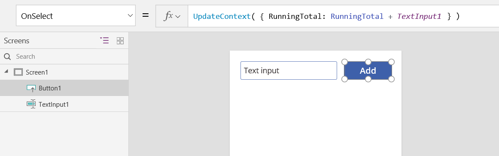
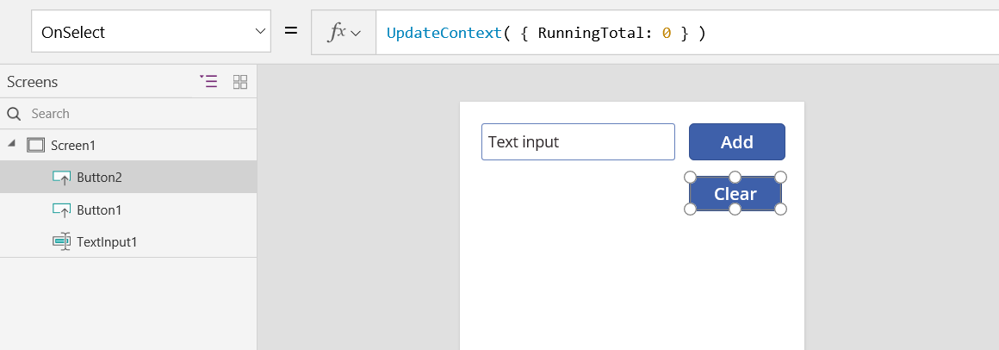
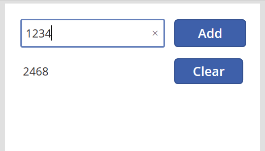
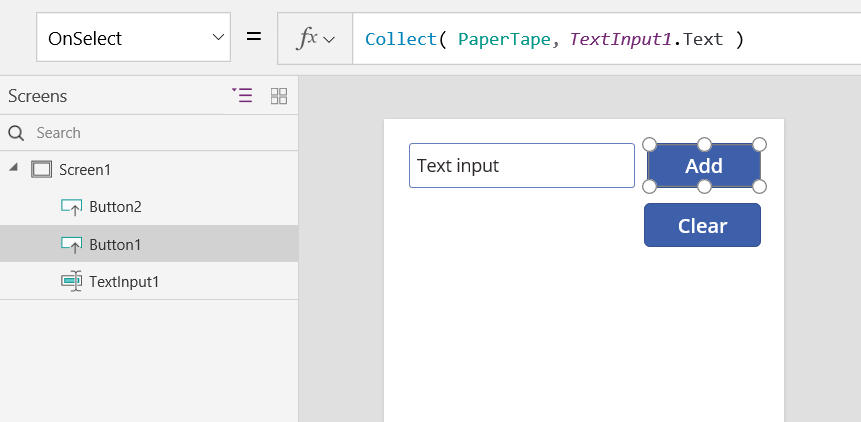

# Grundlegendes zu Canvas-App-Variablen in PowerApps

Wenn Sie eine anderes Programmiertool verwenden, z. B. Visual Basic oder JavaScript verwendet haben, können Sie Fragen, werden: **Wo sind die Variablen?** PowerApps ist etwas anders und erfordert einen anderen Ansatz. Statt auf eine Variable zurückzugreifen, wenn Sie eine Canvas-app erstellen, stellen Sie sich: **Was würde ich in Excel?**

In anderen Tools haben Sie möglicherweise eine explizite Berechnung ausgeführt und das Ergebnis in einer Variablen gespeichert. Allerdings berechnen sowohl PowerApps als auch Excel automatisch Formeln neu, sobald die Eingabedaten geändert werden, sodass Sie üblicherweise keine Variablen erstellen oder aktualisieren müssen. Wenn Sie diesen Ansatz wann immer möglich verwenden, können Sie Ihre App leichter erstellen, verstehen und warten.

In einigen Fällen müssen Sie Variablen in PowerApps verwenden, wodurch das Modell von Excel um [Verhaltensformeln](working-with-formulas-in-depth.md) erweitert wird. Diese Formeln werden z.B. ausgeführt, wenn ein Benutzer eine Schaltfläche auswählt. Innerhalb einer Verhaltensformel ist es oft hilfreich, eine Variable festzulegen, die in anderen Formeln verwendet werden soll.

Vermeiden Sie im allgemeinen das Verwenden von Variablen. Manchmal hat jedoch nur eine Variable die Auswirkungen, die Sie benötigen. Variablen werden implizit erstellt und eingegeben werden, wenn sie in der Funktionen angezeigt werden, die deren Werte festgelegt sind. 

## Excel in PowerApps übersetzt

### Excel

Betrachten Sie die Funktionsweise von Excel. Eine Zelle kann einen Wert, z.B. eine Zahl oder eine Zeichenfolge, oder eine Formel enthalten, die auf den Werten der anderen Zellen basiert. Nachdem der Benutzer einen anderen Wert in eine Zelle eingibt, berechnet Excel automatisch alle Formeln, die von dem neuen Wert abhängig sind. Zum Aktivieren dieses Verhaltens müssen Sie nichts programmieren.

Im folgenden Beispiel Zelle **A3** festgelegt ist, auf die Formel **A1 + A2**. Wenn **A1** oder **A2** Änderungen **A3** automatisch neu berechnet, um die Änderung zu übernehmen. Dieses Verhalten erfordert keine Codierung außerhalb der Formel selbst.

Excel verfügt nicht über Variablen. Der Wert einer Zelle, die eine Formel enthält, ändert sich abhängig von seiner Eingabe; es gibt allerdings keine Möglichkeit, das Ergebnis einer Formel in einer Zelle oder an einer anderen Stelle zu speichern. Wenn Sie den Wert einer Zelle ändern, ändert sich möglicherweise das gesamte Arbeitsblatt, und alle zuvor berechneten Werte gehen verloren. Ein Excel-Benutzer kann Zellen kopieren und einfügen, aber dies unterliegt der manuellen Eingabe des Benutzers und ist mit Formeln nicht möglich.

### PowerApps

Apps, die Sie in PowerApps erstellen, verhalten sich ähnlich wie Excel. Statt Zellen zu aktualisieren, können Sie Steuerelemente überall auf dem Bildschirm hinzufügen und sie für den Einsatz in Formeln benennen.

Sie können z. B. das Verhalten von Excel in einer app replizieren, durch das Hinzufügen einer **[Bezeichnung](controls/control-text-box.md)** Steuerelement, mit dem Namen **Label1**, und zwei **[fürEingabetext](controls/control-text-input.md)** Steuerelemente, mit dem Namen **TextInput1** und **TextInput2**. Setzen Sie dann die **[Text](controls/properties-core.md)** Eigenschaft **Label1** zu **TextInput1 + TextInput2**, es wird immer angezeigt, befinden sich die Summe von alle Zahlen in **TextInput1** und **TextInput2** automatisch.

Beachten Sie, dass die **Label1** Steuerelement ausgewählt ist, dessen **[Text](controls/properties-core.md)** Formel in der Bearbeitungsleiste am oberen Rand des Bildschirms. Hier finden Sie die Formel **TextInput1 + TextInput2**. Diese Formel erstellt eine Abhängigkeit zwischen diesen Steuerelementen, genauso wie Abhängigkeiten zwischen den Zellen in einer Excel-Arbeitsmappe erstellt werden.  Ändern Sie den Wert der **TextInput1**:

Die Formel für **Label1** wurde automatisch neu berechnet, mit dem neuen Wert.

In PowerApps können Sie Formeln nicht nur verwenden, um den primären Wert eines Steuerelements zu bestimmen, sondern auch, um Eigenschaften, wie z.B. das Format, zu bestimmen. Im nächsten Beispiel zeigt eine Formel für die **[Color](controls/properties-color-border.md)** -Eigenschaft der Bezeichnung automatisch negative Werte rot an. Die **[If](functions/function-if.md)** -Funktion ist Ihnen wahrscheinlich aus Excel vertraut:

`If( Value(Label1.Text) < 0, Red, Black )`

Sie können verschiedene Formeln für eine Vielfalt an Szenarios verwenden:

* Indem Sie das GPS Ihres Geräts verwenden, kann ein Kartensteuerelement mit einer Formel, die **Location.Latitude** und **Location.Longitude** verwendet, Ihre aktuelle Standort anzeigen.  Während Sie sich bewegen, verfolgt die Karte automatisch Ihren Standort.
* Andere Benutzer können [Datenquellen](working-with-data-sources.md) aktualisieren.  Andere Mitglieder Ihres Teams können z.B. die Elemente in einer SharePoint-Liste aktualisieren.  Wenn Sie eine Datenquelle aktualisieren, werden alle abhängigen Formeln automatisch neu berechnet, um die aktualisierten Daten widerzuspiegeln. Wenn Sie das Beispiel fortführen, können Sie beispielsweise die **[Items](controls/properties-core.md)** -Eigenschaft eines Katalogs auf die Formel **Filter (SharePointList)** festlegen, sodass automatisch die neu gefilterte Menge von [Datensätze](working-with-tables.md#records) angezeigt wird.

### Vorteile

Das Erstellen von Apps mithilfe von Formeln hat viele Vorteile:

* Wenn Sie Excel kennen, kennen Sie PowerApps. Das Modell und die Formelsprache sind identisch.
* Wenn Sie schon mal andere Programmiertools verwendet haben, können Sie sich vorstellen, wie viel Code erforderlich wäre, um diese Beispiele zu realisieren.  In Visual Basic müssten Sie einen Ereignishandler für das Änderungsereignis für jedes Texteingabe-Steuerelement erstellen.  Der Code, der jede dieser Berechnung ausführen soll, ist redundant und könnte möglicherweise nicht mehr synchron abgerufen werden, oder Sie müssten eine gängige Unterroutine schreiben.  In PowerApps erreichen Sie das alles mit einer einzigen, einzeiligen Formel.
* Womit **Label1**der Text stammt, Sie wissen genau, wo Sie suchen: die Formel in der **[Text](controls/properties-core.md)** Eigenschaft.  Es gibt keine andere Möglichkeit, den Text dieses Steuerelements zu beeinflussen.  In einem herkömmlichen Programmiertool könnte jeder Ereignishandler und jede Unterroutine überall im Programm den Wert des Bezeichners ändern.  Dadurch kann es schwieriger sein, einzugrenzen, wann und wo eine Variable geändert wurde.
* Wenn der Benutzer ein Schieberegler-Steuerelement ändert und es sich dann noch mal anders überlegt, kann er den Schieberegler wieder auf den ursprünglichen Wert zurücksetzen.  Und es ist, als ob nichts geändert worden wäre: Die Anwendung zeigt die gleichen Steuerelementwerte wie vorher an.  Das Experimentieren und Fragen nach „Was wäre wenn“ hat keine Folgen, genauso wenig wie in Excel.  

Im Allgemeinen sind Sie bessergestellt, wenn Sie durch das Verwenden einer Formel einen Effekt erzielen können. Lassen Sie die Formel-Engine in PowerApps für Sie arbeiten.  

## Wann es sinnvoll ist, Variablen zu verwenden

Passen Sie Ihren einfachen Addierer an, sodass er sich wie eine traditionelle Rechenmaschine mit einer laufenden Summe verhält. Wenn Sie eine **Add**-Schaltfläche (Hinzufügen) auswählen, fügen Sie eine Zahl zur laufenden Summe hinzu. Wenn Sie eine **Clear**-Schaltfläche (Löschen) auswählen, setzen Sie die laufende Summe auf 0 (null) zurück.

| Anzeige | Beschreibung |
|----|----|
|   | Wenn die app gestartet wird, ist die laufende Summe 0.  Der rote Punkt steht dem Finger des Benutzers in das Texteingabe-Feld, in denen der Benutzer eingibt, **77**. |
|  | Der Benutzer wählt die **hinzufügen** Schaltfläche. |
|  | die laufende Summe wird 77 hinzugefügt.  Der Benutzer wählt die **hinzufügen** erneut. |
|  | 77 wird erneut die laufende Summe an, was zu 154 hinzugefügt.  Der Benutzer wählt die **löschen** Schaltfläche. |
|  | Es wird die laufende Summe auf 0 zurückgesetzt. |

Ihre Rechenmaschine verwendet etwas, das es in Excel so nicht gibt: eine Schaltfläche. Sie können in dieser App die laufende Summe nicht mit Formeln allein berechnen, da ihr Wert von einer Reihe von Aktionen des Benutzers abhängt. Stattdessen muss die laufende Summe aufgezeichnet und manuell aktualisiert werden. Die meisten Programmiertools speichern diese Informationen in einer *Variablen*.

Manchmal benötigen Sie für Ihre App eine Variable, um das zu erreichen, was Sie möchten.  Doch dieser Ansatz hat auch Nachteile:

* Sie müssen die laufende Summe manuell aktualisieren. Die automatische Berechnung erfüllt nicht Ihre Ansprüche.
* Die laufende Summe kann nicht mehr basierend auf den Werten anderer Steuerelemente berechnet werden. Dies hängt davon ab, wie oft der Benutzer die Schaltfläche **Add** (Hinzufügen) ausgewählt hat und welcher Wert sich jeweils in dem Texteingabe-Steuerelement befunden hat. Hat der Benutzer 77 eingegeben und **Hinzufügen** zweimal ausgewählt, oder hat er jeweils 24 und 130 für jede der Hinzufügungen angegeben? Nachdem die Summe 154 beträgt, können Sie den Unterschied nicht mehr feststellen.
* Änderungen der Gesamtsumme können aus verschiedenen Pfaden stammen. In diesem Beispiel kann sowohl die **Add**- als auch die **Clear**-Schaltflächen die Gesamtsumme aktualisieren. Wenn die App sich nicht wie erwartet verhält, ist welche Schaltfläche für das Problem verantwortlich?

## Verwenden Sie eine globale variable

Sie benötigen eine Variable, die die laufende Summe enthält, um unseren hinzufügenden Computer zu erstellen. Die einfachsten Variablen, mit denen Sie in PowerApps arbeiten können, sind *globale Variablen*.  

Funktionsweise von globalen Variablen:

* Sie legen den Wert der globalen Variablen mit der **[Set](functions/function-set.md)** -Funktion fest.  Durch **Set( MyVar, 1 )** wird die globale Variable **MyVar** auf den Wert **1** festgelegt.
* Sie verwenden die globale Variable, indem Sie mit der **Set**-Funktion auf den verwendeten Namen verweisen.  In diesem Fall gibt **MyVar** den Wert **1** zurück.
* Globale Variablen können beliebige Werte enthalten, z.B. Zeichenfolgen, Zahlen, Datensätze und [Tabellen](working-with-tables.md).

Erstellen Sie Ihre Rechenmaschine mithilfe einer globalen Variablen neu:

1. Fügen Sie ein Texteingabe-Steuerelement mit dem Namen **TextInput1** hinzu, und zwei Schaltflächen mit dem Namen **Button1** und **Button2**.

2. Legen Sie die **[Text](controls/properties-core.md)** -Eigenschaft von **Button1** auf **"Add"** fest, und legen Sie die **Text**-Eigenschaft von **Button2** auf **"Clear"** fest.

3. Legen Sie die **[OnSelect](controls/properties-core.md)** -Eigenschaft einer **Add**-Schaltfläche auf folgende Formel fest, um die laufende Summe zu aktualisieren, wenn ein Benutzer die Schaltfläche auswählt:

    **Set( RunningTotal, RunningTotal + TextInput1 )**

    Das bloße Vorhandensein dieser Formel wird **RunningTotal** als globale Variable, die eine Zahl aufgrund der enthält die **+** Operator. Sie können auf verweisen **RunningTotal** an einer beliebigen Stelle in der app. Sobald der Benutzer diese app öffnet **RunningTotal** hat einen Anfangswert von *leere*.

    Beim ersten, die ein Benutzer wählt die **hinzufügen** Schaltfläche und **[festgelegt](functions/function-set.md)** ausgeführt wird, **RunningTotal** festgelegt ist, auf den Wert  **RunningTotal + TextInput1**.

    

4. Legen Sie die **[OnSelect](controls/properties-core.md)** -Eigenschaft der **Clear**-Schaltfläche auf folgende Formel fest, um die laufende Summe auf **0** festzulegen:

    **Set( RunningTotal, 0 )**

    

5. Fügen Sie ein **[Label](controls/control-text-box.md)** -Steuerelement (Bezeichnung) hinzu, und legen Sie dessen **[Text](controls/properties-core.md)** -Eigenschaft auf **RunningTotal** fest.

    Diese Formel wird automatisch neu berechnet und zeigt dem Benutzer den Wert von **RunningTotal** an, während sie sich auf Grundlage der vom Benutzer ausgewählten Schaltflächen ändert.

    

6. Sehen sie sich eine Vorschau der App an, und Sie sehen die Rechenmaschine, wie sie oben beschrieben wurde. Geben Sie eine Zahl im Textfeld ein, und drücken Sie mehrmals die Schaltfläche **Add**. Kehren Sie anschließend zur Erstellung zurück, indem Sie die ESC-TASTE drücken.

    

7. Wählen Sie zum Anzeigen der Wert der globalen Variablen die **Datei** , und wählen **Variablen** im linken Bereich.

    

8. Wählen Sie diese Schritte aus, um alle Stellen anzeigen, in dem die Variable definiert und verwendet wird.

    

## Typen von Variablen

PowerApps verfügt über drei Arten von Variablen:

| Variablentyp | Umfang | Beschreibung | Funktionen, die herstellen |
| --- | --- | --- | --- |
| Globale Variablen |App |Sind am einfachsten zu verwenden. Enthalten eine Zahl, eine Textzeichenfolge, einen booleschen Wert, einen Datensatz, eine Tabelle usw., auf die an einer beliebigen Stelle in der App verwiesen werden kann. |[**Set**](functions/function-set.md) |
| Kontextvariablen |Bildschirm |Ideal für die Übergabe von Werten an einen Bildschirm (ähnelt der Übergabe eines Parameters an eine Prozedur in anderen Sprachen). Kann von nur einem Bildschirm verwiesen werden. |[**UpdateContext**](functions/function-updatecontext.md) [**Navigate**](functions/function-navigate.md) |
| Sammlungen |App |Enthält eine Tabelle, die aus an einer beliebigen Stelle in der app verwiesen werden kann. Ermöglichen es, dass der Inhalt der Tabelle geändert wird, und wird nicht in seiner Gesamtheit festgelegt. Können für die spätere Verwendung auf dem lokalen Gerät gespeichert werden. |[**Collect**](functions/function-clear-collect-clearcollect.md) [**ClearCollect**](functions/function-clear-collect-clearcollect.md) |

## Erstellen und Entfernen von Variablen

Alle Variablen werden implizit erstellt, wenn sie in angezeigt werden eine **festgelegt**, **"updatecontext"** , **Navigate**, **sammeln**, oder  **ClearCollect** Funktion. Um eine Variable und ihren Typ zu deklarieren, muss nur diese in einer dieser Funktionen eine beliebige Stelle in Ihrer app eingeschlossen werden. Keiner dieser Funktionen erstellen Sie Variablen; Sie werden nur Variablen mit Werten füllen. Sie deklarieren nie Variablen explizit Sie in eine anderes Programmiertool verwenden können, und alle Eingabe ist implizit von der Nutzung.

Angenommen, Sie müssen möglicherweise ein Schaltflächen-Steuerelement mit einem **OnSelect** Formel gleich **Set (X, 1)** . Diese Formel wird **X** als Variable mit einem Datentyp Number. Sie können **X** in Formeln als eine Zahl aus, und diese Variable hat den Wert *leere* nach dem Öffnen der app, aber bevor Sie die Schaltfläche auswählen. Wenn Sie die Schaltfläche auswählen, geben Sie **X** den Wert der **1**.

Wenn Sie eine weitere hinzugefügt Schaltfläche, und legen Sie seine **OnSelect** Eigenschaft **Set (X, "Hello")** , würde ein Fehler auftreten, da der Typ (Textzeichenfolge) nicht den Typ in der vorherigen übereinstimmt **festgelegt**(Anzahl). Alle implizite Definitionen der Variablen müssen auf dem Typ übereinstimmen. In diesem Fall all dies passiert, weil Sie erwähnt **X** in Formeln, die nicht verwendet werden, da keines dieser Formeln nicht tatsächlich ausgeführt haben.

Sie eine Variable entfernen, indem Sie alle Entfernen der **festgelegt**, **"updatecontext"** , **Navigate**, **sammeln**, oder **ClearCollect**  Funktionen, die die Variable implizit herstellen. Ohne diese Funktionen nicht die Variable nicht vorhanden. Sie müssen auch alle Verweise auf die Variable entfernen, da sie einen Fehler verursacht.

## Die Lebensdauer der Variablen und Anfangswert

Alle Variablen werden im Arbeitsspeicher gehalten, während die app ausgeführt wird. Nach dem Schließen der app sind die Werte, die die Variablen gehalten verloren gehen.

Sie können den Inhalt einer Variablen in einer Datenquelle speichern, mithilfe der **Patch** oder **sammeln** Funktionen. Sie können auch Werte in Auflistungen, auf dem lokalen Gerät speichern, mithilfe der [ **SaveData** ](functions/function-savedata-loaddata.md) Funktion.

Wenn der Benutzer die app geöffnet wird, müssen alle Variablen einen Anfangswert von *leere*.

## Variablen werden gelesen

Verwenden Sie den Namen der Variablen, um den Wert zu lesen. Beispielsweise können Sie eine Variable mit dieser Formel definieren:

`Set( Radius, 12 )`

Dann können Sie einfach mithilfe **Radius** allen Orten mit Sie eine Zahl können, und er wird durch ersetzt **12**:

`Pi() * Power( Radius, 2 )`

Wenn Sie einer Kontextvariable besitzen den gleichen Namen wie eine globale Variable oder eine Sammlung zuweisen, hat die Kontextvariable Vorrang vor. Sie jedoch können weiterhin verweisen, die globale Variable oder Sammlung bei Verwendung der [Operator zur mehrdeutigkeitsvermeidung](functions/operators.md#disambiguation-operator) **@[Radius]** .

## Verwenden Sie eine Kontextvariable

Im Folgenden wird erläutert, wie die Rechenmaschine mit einer Kontextvariablen und nicht mit einer globalen Variablen erstellt wird.

Funktionsweise von Kontextvariablen:

* Sie implizit herstellen und Festlegen der Kontextvariablen mithilfe der **["updatecontext"](functions/function-updatecontext.md)** oder **[Navigate](functions/function-navigate.md)** Funktion. Die app gestartet wird, ist der anfängliche Wert alle Kontextvariablen *leere*.
* Sie aktualisieren Kontextvariablen mit Datensätzen. In anderen Programmiertools verwenden Sie häufig „=“ für Zuweisungen, wie z.B. in „x = 1“. Verwenden Sie für Kontextvariablen **{x: 1}** stattdessen. Wenn Sie eine Kontextvariable verwenden, verwenden Sie den Namen direkt ohne die Datensatz-Syntax.
* Sie können eine Kontextvariable auch festlegen, bei der Verwendung der **[Navigate](functions/function-navigate.md)** Funktion, um einen Bildschirm anzeigen. Wenn Sie einen Bildschirm als eine Art Prozedur oder Unterroutine, diesen Ansatz vorstellen ähnelt Parameterübergabe in anderen Programmiersprachen kennen.
* Mit Ausnahme von **[Navigate](functions/function-navigate.md)** sind Kontextvariablen auf den Kontext eines einzelnen Bildschirms beschränkt, wo sie ihren Namen erhalten. Außerhalb dieses Kontexts können Sie sie weder verwenden noch festlegen.
* Kontextvariablen können jeden Wert enthalten, z.B. Zeichenfolgen, Zahlen, Datensätze und [Tabellen](working-with-tables.md).

Erstellen Sie Ihren hinzufügenden Computer mithilfe einer Kontextvariablen neu:

1. Fügen Sie ein Texteingabe-Steuerelement mit dem Namen **TextInput1** hinzu, und zwei Schaltflächen mit dem Namen **Button1** und **Button2**.

2. Legen Sie die **[Text](controls/properties-core.md)** -Eigenschaft von **Button1** auf **"Add"** fest, und legen Sie die **Text**-Eigenschaft von **Button2** auf **"Clear"** fest.

3. Legen Sie die **[OnSelect](controls/properties-core.md)** -Eigenschaft einer **Add**-Schaltfläche auf folgende Formel fest, um die laufende Summe zu aktualisieren, wenn ein Benutzer die Schaltfläche auswählt:

    **UpdateContext ({RunningTotal: RunningTotal + TextInput1 } )**

    Das bloße Vorhandensein dieser Formel wird **RunningTotal** wie eine Kontextvariable besitzen, die eine Zahl aufgrund der enthält die **+** Operator. Sie können auf verweisen **RunningTotal** an einer beliebigen Stelle in diesem Bildschirm. Sobald der Benutzer diese app öffnet **RunningTotal** hat einen Anfangswert von *leere*.

    Beim ersten, die der Benutzer wählt die **hinzufügen** Schaltfläche und **["updatecontext"](functions/function-updatecontext.md)** ausgeführt wird, **RunningTotal** festgelegt ist, auf den Wert **RunningTotal + TextInput1**.

    

4. Legen Sie die **[OnSelect](controls/properties-core.md)** -Eigenschaft der **Clear**-Schaltfläche auf folgende Formel fest, um die laufende Summe auf **0** festzulegen:

    **UpdateContext ({RunningTotal: 0 } )**

    In diesem Fall **["updatecontext"](functions/function-updatecontext.md)** wird verwendet, mit der Formel **UpdateContext ({RunningTotal: 0 } )** .

    

5. Fügen Sie ein **[Label](controls/control-text-box.md)** -Steuerelement (Bezeichnung) hinzu, und legen Sie dessen **[Text](controls/properties-core.md)** -Eigenschaft auf **RunningTotal** fest.

    Diese Formel wird automatisch neu berechnet und zeigt dem Benutzer den Wert von **RunningTotal** an, während sie sich auf Grundlage der vom Benutzer ausgewählten Schaltflächen ändert.

    

6. Sehen sie sich eine Vorschau der App an, und Sie sehen die Rechenmaschine, wie sie oben beschrieben wurde. Geben Sie eine Zahl im Textfeld ein, und drücken Sie mehrmals die Schaltfläche **Add**. Kehren Sie anschließend zur Erstellung zurück, indem Sie die ESC-TASTE drücken.

    

7. Sie können den Wert einer Kontextvariablen beim Wechsel zu einem Bildschirm festlegen. Dies ist hilfreich, wenn Sie den „Kontext“ bzw. die „Parameter“ von einem Bildschirm an einen anderen übergeben möchten. Um dieses Verfahren zu veranschaulichen, fügen Sie einen Bildschirm, fügen Sie eine Schaltfläche, und legen dessen **OnSelect** -Eigenschaft auf diese Formel:

    **Navigate( Screen1, None, { RunningTotal: -1000 } )**

    

    Die Alt-Taste gedrückt, während Sie auf diese Schaltfläche, um beide anzeigen auswählen **Screen1** und legen Sie die Kontextvariable **RunningTotal** auf-1000.

    

8. Um den Wert der Kontextvariablen anzuzeigen, wählen Sie die **Datei** Menü, und wählen Sie dann **Variablen** im linken Bereich.

    

9. Wählen Sie diese Schritte aus, um anzuzeigen, in denen die Kontextvariable definiert und verwendet wird.

    

## Verwenden Sie eine Sammlung

Veranschaulichen wir abschließend das Erstellen der Rechenmaschine mithilfe einer Sammlung.  Da eine Sammlung eine Tabelle enthält, die leicht geändert werden kann, legen wir fest, dass diese Rechenmaschine bei Eingabe der einzelnen Werte einen „Papierstreifen“ des Werts aufbewahrt.

Funktionsweise von Sammlungen:

* Erstellen Sie Sammlungen mithilfe der **[ClearCollect](functions/function-clear-collect-clearcollect.md)** -Funktion, oder legen Sie diese fest.  Sie können stattdessen die **[Collect](functions/function-clear-collect-clearcollect.md)** -Funktion verwenden; jedoch erfordert diese eine andere Variable statt die alte lediglich zu ersetzen.  
* Eine Sammlung ist eine Art von Datenquelle und somit eine Tabelle. Verwenden Sie die **[First](functions/function-first-last.md)** -Funktion, um auf einen einzelnen Wert in einer Sammlung zuzugreifen, und extrahieren Sie ein Feld aus dem resultierenden Datensatz. Wenn Sie einen einzelnen Wert mit **[ClearCollect](functions/function-clear-collect-clearcollect.md)** verwendet haben, ist dies das **Value**-Feld, wie in diesem Beispiel: 
**First(** *VariableName* **).Value**

Erstellen Sie Ihre Rechenmaschine mithilfe einer Sammlung neu:

1. Fügen Sie ein  **[Texteingabe](controls/control-text-input.md)** -Steuerelement mit dem Namen **TextInput1** hinzu, und zwei Schaltflächen mit dem Namen **Button1** und **Button2**.

2. Legen Sie die **[Text](controls/properties-core.md)** -Eigenschaft von **Button1** auf **"Add"** fest, und legen Sie die **Text**-Eigenschaft von **Button2** auf **"Clear"** fest.

3. Legen Sie die **[OnSelect](controls/properties-core.md)** -Eigenschaft einer **Add**-Schaltfläche auf folgende Formel fest, um die laufende Summe zu aktualisieren, wenn ein Benutzer die Schaltfläche auswählt:

    **Collect( PaperTape, TextInput1.Text )**

    Das bloße Vorhandensein dieser Formel wird **PaperTape** als eine Auflistung, die eine einspaltige Tabelle von Textzeichenfolgen enthält. Sie können auf verweisen **PaperTape** an einer beliebigen Stelle in dieser app. Wenn ein Benutzer diese app öffnet **PaperTape** wird eine leere Tabelle.

    Wenn diese Formel ausgeführt wird, fügt es den neuen Wert an das Ende der Auflistung hinzu. Da wir nur einen Wert hinzufügen **sammeln** platziert es automatisch in eine einspaltige Tabelle, und der Spaltenname ist **Wert**, die Sie später verwenden werden.

    

4. Auf der Papierstreifen gelöscht wird, wenn der Benutzer auswählt der **löschen** Schaltfläche, legen Sie dessen **[OnSelect](controls/properties-core.md)** -Eigenschaft auf diese Formel:

    **Clear( PaperTape )**

    

5. Fügen Sie eine Bezeichnung hinzu, um die laufende Summe anzuzeigen, und legen Sie ihre **[Text](controls/properties-core.md)** -Eigenschaft auf folgende Formel fest:

    **Sum( PaperTape, Value )**

    

6. Um die Rechenmaschine auszuführen, drücken Sie F5, um die Vorschau zu öffnen, geben Sie im Texteingabe-Steuerelement Zahlen ein, und wählen Sie Schaltflächen aus.

    

7. Drücken Sie die ESC-TASTE, um zum Standardarbeitsbereich zurückzukehren.

8. Fügen Sie zum Anzeigen des Papierstreifens ein **Datentabellen**-Steuerelement hinzu, und legen Sie dessen **[Items](controls/properties-core.md)** -Eigenschaft auf diese Formel fest:

    **PaperTape**

    Wählen Sie im rechten Bereich die **Wert** Spalte, um es anzuzeigen.

    

9. Wählen Sie im **Dateimenü** **Collections** (Sammlungen) aus, um die Werte in Ihrer Sammlung anzuzeigen.

    

10. Klicken Sie zum Speichern und Abrufen der Sammlung, fügen Sie zwei weitere Schaltflächensteuerelemente hinzu, und legen ihre **Text** Eigenschaften **Load** und **speichern**. Legen Sie die **OnSelect** Eigenschaft der **Load** Schaltfläche auf diese Formel:

     **Clear( PaperTape ); LoadData( PaperTape, "StoredPaperTape", true )**

     Müssen Sie die Auflistung zuerst da löschen **LoadData** fügt die gespeicherten Werte an das Ende der Auflistung.

     

11. Legen Sie die **OnSelect** Eigenschaft der **speichern** Schaltfläche auf diese Formel:

     **SaveData( PaperTape, "StoredPaperTape" )**

     

12. Drücken Sie erneut F5, um die Vorschau aufzurufen, geben Sie Zahlen im Textsteuerelement ein, und wählen Sie Schaltflächen aus. Wählen Sie die Schaltfläche **Save** aus. Schließen und Laden Sie die app neu, und wählen Sie die **Load** Schaltfläche, um Ihre Sammlung neu zu laden.

> [!NOTE]
> **SaveData** und **LoadData** -Funktion in PowerApps Mobile jedoch keine PowerApps Studio oder der webplayer für PowerApps.