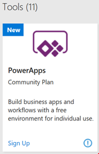

# Power Apps Communityplan: eine kostenlose Entwicklungsumgebung für die individuelle Nutzung
Wenn Sie Fähigkeiten erlangen und mehr über Power Apps, Power Automate und Common Data Service erfahren möchten, ist der Power Apps Communityplan der richtige Plan für Sie. Der Power Apps Communityplan bietet Ihnen eine kostenlose Entwicklungsumgebung für einzelne Verwendung, in der Sie Folgendes tun können:

* Erfahren Sie, wie Sie Unternehmens-Apps und Workflows mit der vollständigen Funktionalität von Power Apps und Power Automate erstellen.
* Stellen Sie eine Verbindung zu jeder Datenquelle her, indem Sie unsere integrierten 100+[Konnektoren](./canvas-apps/connections-list.md) verwenden, oder indem Sie eigene [benutzerdefinierte Konnektoren](./canvas-apps/register-custom-api.md) erstellen.
* Erkunden Sie, wie Sie [den Common Data Service](https://docs.microsoft.com/common-data-service/entity-reference/introduction) verwenden können, um leistungsstarke Unternehmens-Apps für das allgemeine Datenmodell und [das SDK](https://aka.ms/eek20s) zu erstellen.
* Exportieren Sie die Lösungen, die Sie in der individuellen Umgebung erstellen, und [führen Sie sie in der AppSource auf](./canvas-apps/dev-appsource-test-drive.md), damit Ihre Kunden einen Test damit durchführen können.

## Wer kann sich für den Power Apps Communityplan registrieren?
Jeder Benutzer mit einem [Arbeits- oder Schulkonto](signup-for-powerapps.md#faq) kann sich für den Power Apps Communityplan registrieren. Wir empfehlen diesen Plan jedoch ganz besonders, wenn Folgendes auf Sie zutrifft:

* Melden Sie sich an, um Fähigkeiten aufzubauen und mehr über Power Apps, Power Automate und Common Data Service zu erfahren.
* An der Erstellung von Unternehmens-Apps und Workflows zur Bereitstellung über AppSource interessiert sind.

## Wo kann ich mich für den Power Apps Communityplan registrieren?
Registrieren Sie sich auf der [Power Apps Communityplan-Website](https://powerapps.microsoft.com/communityplan). Wenn Sie bereits ein Benutzer von Power Apps mit Office 365 oder Dynamics 365 sind, können Sie auch [eine Umgebung für einzelne Nutzung](https://make.powerapps.com/community/signup) erstellen.

Nach der Registrierung für den Communityplan werden Sie zu zur [Power Apps Website](https://make.powerapps.com?utm_source=padocs&utm_medium=linkinadoc&utm_campaign=referralsfromdoc) weitergeleitet und gelangen zu Ihrer individuellen Umgebung. Die Umgebung wird mit Ihrem Namen benannt, beispielsweise „Erika Mustermanns Umgebung“. Falls bereits eine Umgebung mit diesem Namen vorhanden ist, wird die einzelne Umgebung als "Umgebung von John Doe (1)" bezeichnet.  Das folgende Bild zeigt das Erscheinungsbild der Umgebung.

### Holen Sie sich den Communityplan mit Visual Studio Dev Essentials
Wenn Sie ein Benutzer von Visual Studio Dev Essentials sind, ist Power Apps in Ihren Vorteilen enthalten. Besuchen Sie [Meine Vorteile](https://my.visualstudio.com/benefits), und klicken oder tippen Sie auf die Power Apps Kachel, um sich für den Power Apps Communityplan zu registrieren.

## Welche Funktionen sind im Power Apps Communityplan eingeschlossen?
Mit der individuellen Umgebung erhalten Sie die folgenden Funktionen:

| **Funktionen** | **Umgebung für einzelne Verwendung** |
| --- | --- |
| **Wichtige Features** | |
| Apps erstellen und ausführen |Ja. Sie können Apps in unbeschränktem Umfang erstellen |
| Apps freigeben\* |Nr. |
| Verwenden Sie die Common Data Service. |Ja |
| Modellieren von Daten mithilfe des Common Data Service |Ja|
| Unternehmensweite Verwaltung der Umgebungen und Benutzerrichtlinien |Ja |
| **Konnektivität** | |
| Stellen Sie eine Verbindung mit Office 365, Dynamics 365 und anderen Konnektoren her |Ja |
| Herstellen von Verbindungen mit cloudbasierten Diensten, wie Azure SQL, Dropbox, Twitter und vielen anderen |Ja |
| Verwenden Sie Premium-Konnektoren wie Salesforce, DB2 und viele mehr |Ja |
| Greifen Sie mit einem lokalen Gateway auf lokale Daten zu |Ja |
| Erstellen von benutzerdefinierten Connectors zum Herstellen von Verbindungen mit Ihren eigenen Systemen |Ja. Sie können benutzerdefinierte Connectors in unbeschränktem Umfang erstellen |
| **Common Data Service** | |
| Eigenständige Anwendungen erstellen und ausführen im Common Data Service |Ja |
| Modellieren von Daten im Common Data Service |Ja |
| Testdatenbank im Common Data Service erstellen |Ja |
| Erstellen und Verwenden von Dataflows |Nr. |
| **Verwaltung** | |
| Hinzufügen von Arbeitskollegen als Ersteller und Administratoren von Umgebungen |Nein |
| Hinzufügen von Arbeitskollegen zu Datenbankrollen |Nr. |
| Unterstützt die Datenrichtlinien, die vom Office 365 Administrator eingerichtet wurden |Ja |
| Einrichten von Datenrichtlinien für die individuelle Umgebung |Ja |

*Sie können keine Apps, Flows, Verbindungen usw. für andere Benutzer Ihres Mandanten freigeben. Ferner können Sie andere Benutzer weder als Umgebungsadministratoren oder -ersteller hinzufügen noch zu den Datenbankrollen im Admin Center hinzufügen.

## Welche Kapazitätsgrenzen bestehen für die individuelle Umgebung?

| **Kapazität** |  |
| --- | --- |
| Flow-Ausführungen pro Monat |750 |
| Größe der Datenbank |200 MB |
| Dateispeicher |2 GB |

Sie können auf die enthaltenen Mengen keine Add-Ons anwenden. Wenn Sie Kapazitätsgrenzen erreichen, empfehlen wird, Power Apps Plan pro Benutzer zu kaufen. Erfahren Sie mehr auf der [Power Apps Preisseite](https://powerapps.microsoft.com/pricing/).

> [!NOTE]
> Die Kapazität der individuellen Umgebung wird, gleich, ob sie verwendet wird oder nicht, nicht auf das Gesamtkontingent Ihres Unternehmens angerechnet.

## In AppSource veröffentlichen
Haben Sie eine App, die Sie gerne mit Kunden teilen möchten? Wir unterstützen jetzt eine Power Apps Test Drive-Lösung auf [AppSource](https://appsource.microsoft.com), sodass Sie Apps und Flows für Kunden freigeben und Leads für das Unternehmen generieren können. Weitere Informationen finden Sie unter [Kunden Ihre Apps auf AppSource testen lassen](./canvas-apps/dev-appsource-test-drive.md).

## Häufig gestellte Fragen
**F:** Was tue ich, wenn ich die Kapazitätsgrenzen der Umgebungen erreiche?

**A:** Die Kapazität wird begrenzt, da diese Umgebungen für individuelle Nutzung und nicht für ein Team oder Herstellungsnutzung gedacht ist. Die bereitgestellte Kapazität ist:

| **Kapazität** |  |
| --- | --- |
| Flow-Ausführungen pro Monat |750 |
| Größe der Datenbank |200 MB |
| Dateispeicher |2 GB |

Wenn Sie eine der Kapazitätsgrenzen erreichen, empfehlen wir Ihnen den Erwerb eines Plans, der den Produktionseinsatz unterstützt. Weitere Informationen zu unseren Plänen und deren Grenzen finden Sie auf der [Power Apps Preisseite](https://powerapps.microsoft.com/pricing/).

**F:** Kann ich die Apps, Flows und anderen Ressourcen, die ich in der individuellen Umgebung erstelle, in eine andere Umgebung übertragen?

**A:** Ja, Sie sollten die Ressourcen aus dieser Umgebung in andere Umgebungen exportieren können. Weitere Informationen finden Sie unter [Migration der Umgebung und Mandaten-App](../administrator/environment-and-tenant-migration.md).

**F:** Läuft mein Abonnement des Power Apps Communityplans eines Tages ab?

**A:** Sie können Ihr Power Apps Communityplan-Abonnement kostenlos unbegrenzt verwenden. Wenn Sie eine individuelle Umgebung aktiv verwenden, verlieren Sie den Zugriff auf die Ressourcen oder Funktionen in dieser Umgebung nicht. Sie werden jedoch eine Verzögerung bemerken, wenn Sie Ihre Common Data Service Datenbank nach einer längeren Zeit der Inaktivität das erste Mal wieder verwenden.  Diese Verzögerung wirkt sich nicht auf die Daten oder Entitäten aus, die in Common Data Service gespeichert werden.

**F:** Kann ich mehrere individuelle Umgebung abrufen oder erstellen?

**A:** Nein, Sie können nur über eine individuelle Umgebung verfügen, die für Sie von Power Apps erstellt wird, wenn Sie sich für den Community-Plan registrieren.

**F:** Was ist der Unterschied zwischen der Testversion von Power Apps Plan und dem Power Apps Communityplan. Für welchen sollte ich mich registrieren?

**A:** Die Testversion von Power Apps und Power Apps Communityplan sind kostenlos. Sie wurden jedoch für unterschiedliche Zwecke erstellt:

**Power Apps Testversion** bietet Power Apps Plan 2 für 30 Tage. Dies ist zum Testen von Power Apps, Common Data Service, und Power Automate. Nach dem Ablauf Ihrer Testversion können Sie einen Plan erwerben. Wenn Sie Power Apps bereits mit Office 365 oder Dynamics 365 verwenden, ist dies der richtige Plan, um die Premiumfunktionen von Power Apps zu testen, die im Power Apps Plan pro Benutzer verfügbar sind.

**Power Apps Communitypla** gibt Ihnen Zugriff auf Power Apps Premium-Funktionen, Common Data Service, und Power Automate für den individuellen Gebrauch. Der Plan ist hauptsächlich für Lernzwecke oder das Erstellen von Unternehmenslösungen gedacht, die für [AppSource Test Drive](./canvas-apps/dev-appsource-test-drive.md) bereitgestellt werden. Dieser Plan ist unbegrenzt verfügbar aber nur zum Lernen und Verbessern Ihrer Fähigkeiten mit Power Apps, Common Data Services und Power Automate gedacht.

**F:** Kann die mich mit meinem persönlichen Konto registrieren?

**A:** Nein, Sie können sich nur mit Ihrem [Arbeits- oder Schulkonto](signup-for-powerapps.md#faq) anmelden. Wir unterstützen derzeit keine Registrierung mit persönlichen Konten.

**F:** Kann ich meine individuelle Umgebung löschen?

**A:** Sie können diese Umgebung nicht selbstständig löschen. Ihr Mandantenadministrator hat die Berechtigungen, die Umgebung zu löschen.
