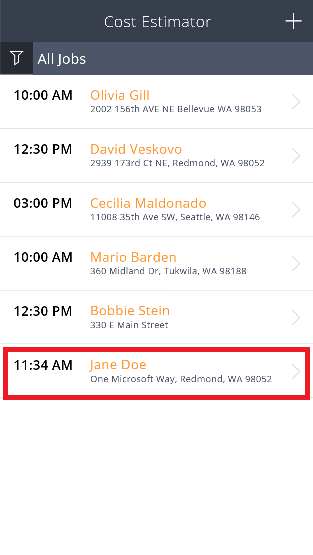
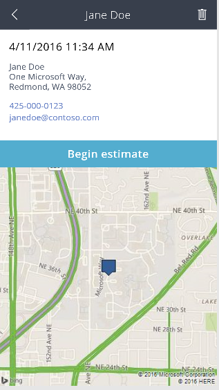
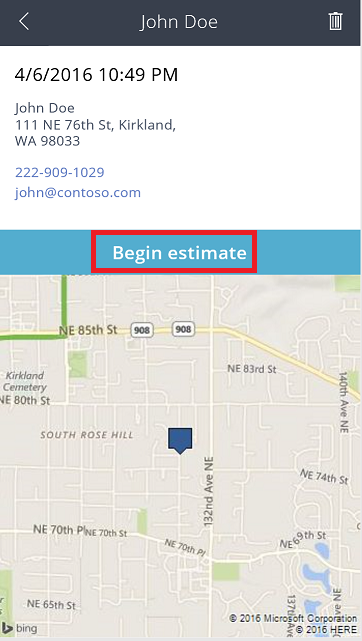
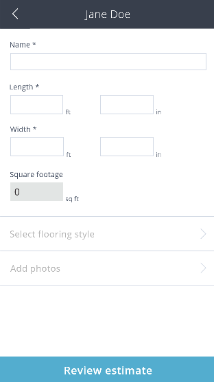
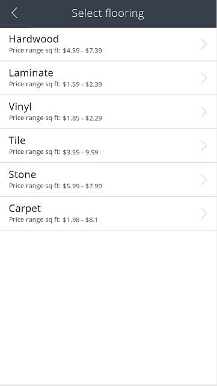
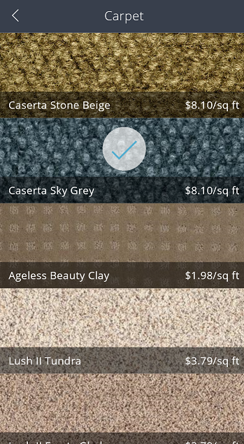
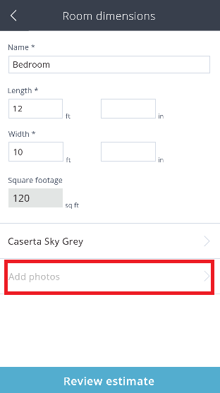

# Eine Beispiel-App verwenden
Verwenden Sie unter [powerapps.com](http://web.powerapps.com) eine Beispiel-App, um Designmöglichkeiten und Konzepte zu entdecken, die Sie anwenden können, wenn Sie Ihre eigenen Apps entwickeln. Jede Beispiel-App verwendet fiktive Daten, um ein Szenario aus der realen Welt darzustellen.

Unter **Cost Estimator** können Sie z.B. eine Beauftragung erstellen, um die Kosten für den Einbau eines Fußbodenprodukts in einem Raum einer bestimmten Größe zu schätzen. Erfassen Sie Informationen wie Adresse und Quadratmeterzahl, und schätzen Sie den Preis basierend auf Rabatten und Steuersätzen. Filtern Sie in der Liste der Beauftragungen, um die anzuzeigen, für die Schätzungen erstellt wurden, für die keine Schätzungen erstellt wurden, oder um alle Beauftragungen anzuzeigen.

## Öffnen der App
1. Melden Sie sich unter [powerapps.com](https://web.powerapps.com) an, und klicken oder tippen Sie anschließend in der Liste der Beispiel-Apps auf **Cost Estimator**.
   
    
2. Klicken oder tippen Sie auf **Telefonversion öffnen**, um die App so anzuzeigen, wie sie auf einem Smartphone aussehen würde. Klicken oder tippen Sie anschließend auf **Zulassen**, um die Zustimmung zur Verwendung der Kamera Ihres Geräts zu erteilen.
   
    Die App enthält z.B. Beispieldaten für das Erstellen von Beauftragungen und das Schätzen der Kosten für den Einbau eines bestimmten Fußbodenprodukts in einem Raum einer bestimmten Größe.
   
    

## Erstellen und Anzeigen einer Beauftragung
1. Klicken oder tippen Sie auf **+**, um eine Beauftragung für eine Schätzung zu erstellen.
   
    
2. Geben Sie Details an, und klicken oder tippen Sie anschließend auf **Save job**.
   
    
   
    Die Beauftragung, die Sie erstellt haben, wird in der Liste der Beauftragungen angezeigt.
   
    
3. Klicken oder tippen Sie auf eine Beauftragung, wie die, die Sie erstellt haben, um deren Details einschließlich einer Karte des Standorts anzuzeigen.
   
    
   
    **Hinweis**: Sie können eine Beauftragung löschen, indem Sie auf das Mülleimersymbol in der rechten oberen Ecke klicken oder tippen.
   
    

## Erstellen einer Schätzung
1. Klicken oder tippen Sie auf der Detailseite der Beauftragung auf **Begin Estimate**.
   
    
2. Geben Sie die erforderlichen Informationen zum Raum wie **Name**, **Length** und **Width** ein, und klicken oder tippen Sie anschließend auf **Select flooring style**.
   
    
   
    Eine Liste der Kategorien der Fußbodenprodukte wird angezeigt.
   
    
3. Klicken oder tippen Sie auf **Carpet** und anschließend auf **Caserta Sky Grey**.
   
    
4. Wenn Sie die App auf einem Gerät verwenden, das über eine Kamera verfügt, klicken oder tippen Sie auf **Add photos**.
   
    
5. Machen Sie mindestens ein Foto, und klicken oder tippen Sie anschließend auf **Done**.
   
    

## Fertigstellen und Absenden einer Schätzung
1. Klicken oder tippen Sie auf **Review Estimate**.
   
    
2. (optional) Geben Sie Daten in **Price adjustment** und **Tax** ein.
3. Fügen Sie eine Signatur hinzu, und klicken oder tippen Sie auf **Submit estimate**.
   
    
   
    Wenn Ihre Browsereinstellungen dies zulassen, wird Ihr Standard-E-Mail-Client mit einer Nachricht geöffnet, die die Informationen der Schätzung enthält.
   
    
   
    Der Bildschirm in PowerApps zeigt an, dass eine Schätzung gesendet wurde.
   
    
4. Klicken oder tippen Sie auf **Done**, um zur Liste der Beauftragungen zurückzukehren.
   
    Die Beauftragung für die Schätzung, die Sie gerade abgeschlossen haben, wird in Grün angezeigt. Dadurch wird angezeigt, dass diese Beauftragung geschlossen ist.
   
    
5. (optional) Klicken oder tippen Sie auf das Filtersymbol in der oberen linken Ecke und filtern Sie in der Liste nach dem Status (offen oder geschlossen), oder lassen Sie alle Beauftragungen anzeigen.

