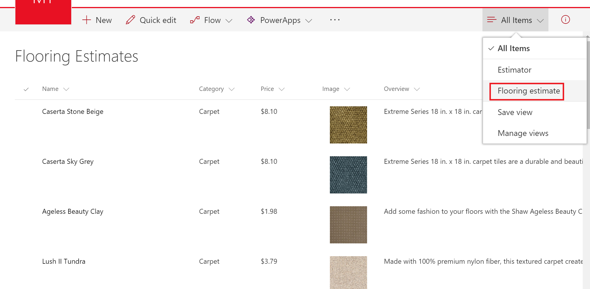
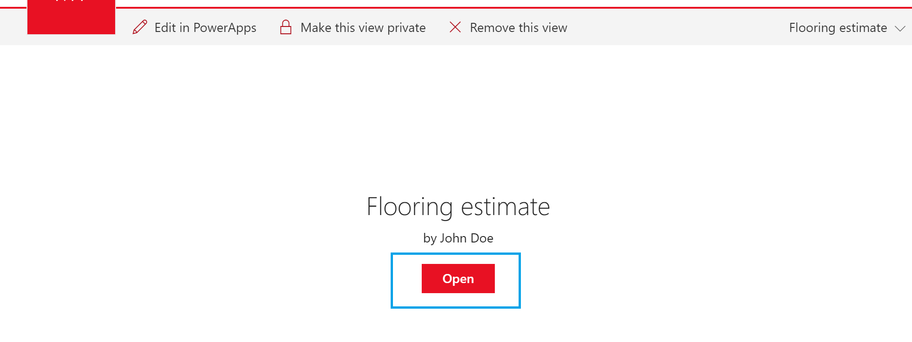
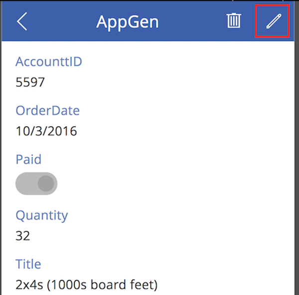

# Öffnen einer App über eine SharePoint Online-Liste
Sie können eine vorhandene App in SharePoint Online öffnen und eine Liste verwalten.

Informationen dazu, welche Typen von SharePoint-Daten von PowerApps unterstützt werden, finden Sie unter [Bekannte Probleme](connections/connection-sharepoint-online.md#known-issues).

## Voraussetzungen
[Erstellen Sie auf der SharePoint-Oberfläche eine App ](generate-app-from-sharepoint-list-interface.md).

## Öffnen der App
1. Öffnen Sie Ihre SharePoint Online-Liste, und wählen Sie in der Liste eine App aus.
   
    
2. Klicken oder tippen Sie auf **Öffnen**.
   
    
   
    Die App wird in einer separaten Registerkarte des Browsers geöffnet.
   
    

## Verwalten der Liste mit der App
> [!NOTE]
> In diesem Thema wird beschrieben, wie Sie eine App öffnen und ausführen, die über eine SharePoint-Liste automatisch erstellt wird. Ein gängigeres Szenario ist, dass die generierte App umfassend angepasst wird, um die Anforderungen der Organisation zu erfüllen. In diesem Fall kann die Nutzung komplexer als hier beschrieben sein.
> 
> 

1. Öffnen Sie die App wie im vorherigen Verfahren beschrieben.
2. Klicken oder tippen Sie auf das Pluszeichen („+“), um der Liste ein Element hinzuzufügen.
   
    
3. Ein Formular wird angezeigt, über das Sie Werte in die Felder der Liste eingeben können. Klicken oder tippen Sie auf das Häkchen, wenn Sie fertig sind.
   
    
4. Klicken oder tippen Sie auf den Pfeil, um die Details für ein Element anzuzeigen.
   
    
5. Klicken oder tippen Sie im angezeigten Formular auf den Stift, um das Element zu bearbeiten.
   
    
6. Nehmen Sie die gewünschten Änderungen vor, und klicken oder tippen Sie dann auf das Häkchen.
   
    
7. Klicken oder tippen Sie in der Ansicht mit den Details auf den Papierkorb, um ein Element zu löschen.
   
    

