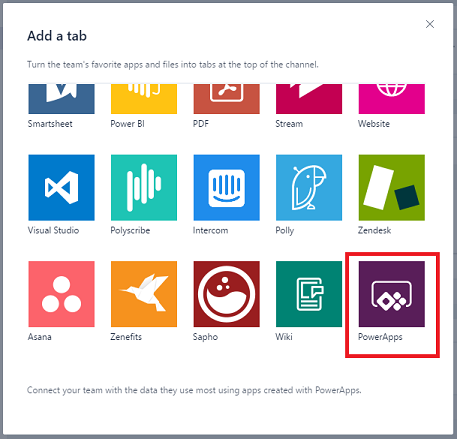
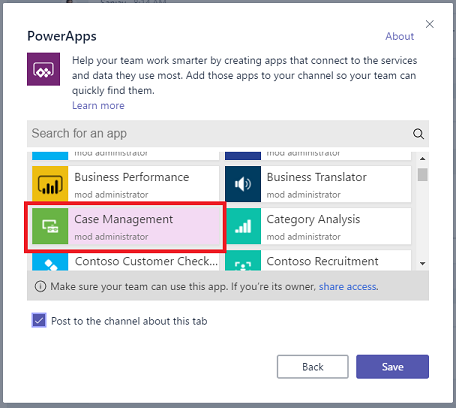
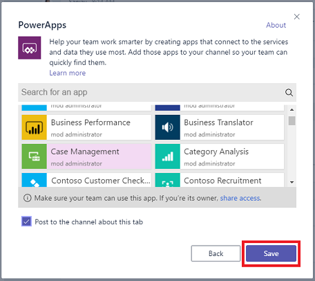
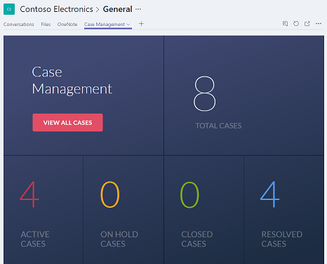

# Hinzufügen und Öffnen einer App in Microsoft Teams
Fügen Sie einem Microsoft Teams-Kanal eine App hinzu, damit alle Benutzer, für die die App freigeben wurde, diese in diesem Kanal öffnen können. Sie können Apps hinzufügen, die Sie erstellt haben oder für die Sie die Berechtigungen **Verwenden** oder **Bearbeiten** haben. Sie können die jeweilige App sowohl in einem Browser als auch in der Desktop-App für Microsoft Teams hinzufügen und öffnen.

## Hinzufügen einer App
1. Sie können die [App für andere Mitglieder des Teams freigeben](share-app.md).
2. Wählen Sie in Microsoft Teams ein Team und einen Kanal für das Team aus.
   
    
3. Klicken oder tippen Sie auf **+**, um eine Registerkarte hinzuzufügen.
   
    
4. Klicken oder tippen Sie im Dialogfeld **Registerkarte hinzufügen** auf **PowerApps**.
   
    
5. Klicken oder tippen Sie auf die App, die Sie hinzufügen möchten.
   
    **Hinweis**: Sie können nach einer App anhand des Namens, des Autors oder der Umgebung suchen.
   
    
6. Klicken oder tippen Sie auf die Schaltfläche **Speichern**.
   
    
   
    Die App kann jetzt im Kanal verwendet werden.
   
    

## Öffnen einer App
1. Wählen Sie in Microsoft Teams das Team und den Kanal aus, der die App enthält.
   
    
2. Klicken oder tippen Sie auf der Registerkarte mit dem Namen der App.
   
    
   
    Die App wird im Kanal geöffnet.
   
    

## Bekannte Probleme
In der Desktop-App für Microsoft Teams:

* Apps müssen Inhalte wie Bilder und PDF-Dateien über eine sichere (HTTPS-) Verbindung laden.
* Nicht alle Sensoren, z. B. **Acceleration**, **Compass** und **Location**, werden unterstützt.
* Nur diese Audio-Formate werden unterstützt: AAC, H264 OGG Vorbis und WAV.

