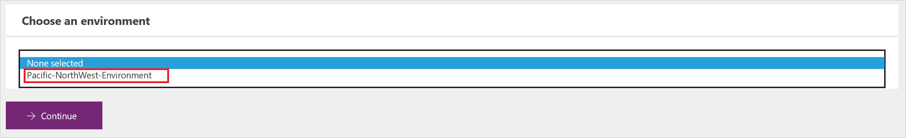
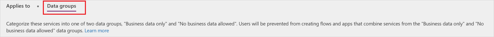
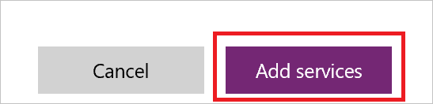
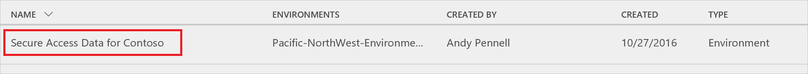

# Richtlinien zur Verhinderung von Datenverlust (DLP)

Die Daten einer Organisation sind wichtig für deren Erfolg. Die Daten müssen zum Treffen von Entscheidungen zum Lesen verfügbar sein, jedoch geschützt werden, damit sie nicht für Personen freigegeben werden, die keinen Zugriff darauf haben sollten. Um diese Daten zu schützen, bietet Microsoft PowerApps (PowerApps) Ihnen die Möglichkeit, Richtlinien zu erstellen und durchzusetzen, die definieren, für welche Verbraucherdienste/Connectors bestimmte Unternehmensdaten freigegeben werden können. Diese Richtlinien, die definieren, wie Daten freigegeben werden können, werden als Richtlinien zur Verhinderung von Datenverlust (DLP) bezeichnet.  

## Warum sollten Sie eine DLP-Richtlinie erstellen?
Sie würden eine DLP-Richtlinie erstellen, um klar zu definieren, für welche Verbraucherdienste Unternehmensdaten freigegeben werden können. Beispielsweise möchte eine Organisation, die PowerApps verwendet, möglicherweise nicht, dass ihre in SharePoint gespeicherten Unternehmensdaten automatisch in Ihrem Twitter-Feed veröffentlicht werden. Um dies zu verhindern, können Sie eine DLP-Richtlinie erstellen, die SharePoint-Daten als Quelle für Tweets blockiert.

Vorteile einer DLP-Richtlinie:
* Stellt sicher, dass Daten in der gesamten Organisation auf einheitliche Weise verwaltet werden  
* Verhindert, dass wichtige Unternehmensdaten versehentlich in Diensten wie auf Webseiten von sozialen Medien veröffentlicht werden   

## Verwalten von DLP-Richtlinien
### Voraussetzungen
Um DLP-Richtlinien zu erstellen, zu bearbeiten oder zu löschen, werden die folgenden Elemente benötigt:

* Entweder Umgebungsadministrator- oder Mandantenadministratorberechtigungen. Weitere Informationen zu Berechtigungen finden Sie im [Umgebungsthema](environments-administration.md)

### Erstellen einer DLP-Richtlinie
Um eine DLP-Richtlinie zu erstellen, brauchen Sie die Berechtigungen für mindestens eine Umgebung.  

Führen Sie diese Schritt aus, um eine DLP-Richtlinie zu erstellen, die verhindert, dass Daten, die in Ihrer SharePoint-Datenbank gespeichert sind, auf Twitter veröffentlicht werden:  

1. Wählen Sie auf der Registerkarte „Datenrichtlinien“ den Link **Neue Richtlinie** aus:  
       
2. Geben Sie den Namen der DLP-Richtlinie als *Sichern des Datenzugriffs für Contoso* unter der Bezeichnung **Name der Datenrichtlinie** oben auf der sich öffnenden Seite ein:   
     
3. Wählen Sie die [Umgebung](environments-administration.md) auf der Registerkarte **Applies to** (Gilt für) aus.  
     
4. Wählen Sie die Registerkarte **Datengruppen** aus:  
     
5. Wählen Sie den Link **+ Add** (Hinzufügen) im Gruppenfeld **Business data only** (Nur Unternehmensdaten) aus:    
     
6. Wählen Sie auf der Seite **Dienste hinzufügen** die Dienste **SharePoint** und **Salesforce** aus:  
     
7. Wählen Sie die Schaltfläche **Dienste hinzufügen** aus, um die von Ihnen ausgewählten Dienste zu der Liste der Dienste hinzuzufügen, die Unternehmensdaten freigeben dürfen:    
     
8. Wählen Sie **Richtlinie speichern** aus:  
     
9. Nach einigen Augenblicken wird Ihre neue DLP-Richtlinie in der Liste der Richtlinien zur Verhinderung von Datenverlust angezeigt:  
     
10. **Optional:** Senden Sie an Ihr Team eine E-Mail oder eine andere Benachrichtigung mit dem Hinweis, dass nun eine neue DLP-Richtlinie verfügbar ist.

Herzlichen Glückwunsch, Sie haben nun eine DLP-Richtlinie erstellt, die es einer App ermöglicht, Daten zwischen SharePoint und Salesforce zu teilen, und die die Freigabe der Daten für andere Dienste blockiert.  

### Suchen einer DLP-Richtlinie
#### Administratoren
Administratoren können die Suchfunktion des Admin Centers verwenden, um bestimmte DLP-Richtlinien zu suchen.  

> [!NOTE]
> Administratoren sollten alle DLP-Richtlinien veröffentlichen, sodass Benutzer sich der Richtlinien bewusst sind, bevor sie PowerApps erstellen.

#### Ersteller
Wenn Sie keine Administratorberechtigungen haben und mehr über die DLP-Richtlinien in Ihrer Organisation erfahren möchten, wenden Sie sich an Ihren Administrator. Weitere Informationen erhalten Sie zudem im [Thema zur Umgebungserstellung](environments-overview.md)  

> [!NOTE]
> Nur Administratoren können DLP-Richtlinien bearbeiten oder löschen.  

### Bearbeiten einer DLP-Richtlinie
1. Starten Sie das Admin Center, indem Sie https://admin.powerapps.com aufrufen.   
2. Wählen Sie im Admin Center, das gestartet wird, auf der linken Seite den Link **Datenrichtlinien** aus.  
     
3. Suchen Sie die Liste der vorhandenen DLP-Richtlinien, und wählen Sie den Link „Bearbeiten“ neben der Richtlinie aus, die Sie bearbeiten möchten:  
     
4. Nehmen Sie die gewünschten Änderungen vor. Sie können z.B. die Umgebung oder die Dienste in den Datengruppen bearbeiten.  
5. Wählen Sie **Richtlinie speichern** aus, um Ihre Änderungen zu speichern:  
     

Die Richtlinie wurde jetzt aktualisiert. Sie können bestätigen, dass die Änderungen an Ihrer Richtlinie vorgenommen wurden, indem Sie diese in der Liste der Richtlinien zur Verhinderung von Datenverlust suchen und ihre Eigenschaften überprüfen.   

### Löschen einer DLP-Richtlinie
1. Starten Sie das Admin Center, indem Sie https://admin.powerapps.com aufrufen.    
2. Wählen Sie im Admin Center, das gestartet wird, auf der linken Seite den Link **Datenrichtlinien** aus.  
     
3. Suchen Sie die Liste der vorhandenen DLP-Richtlinien, und wählen Sie den Link „Löschen“ neben der Richtlinie aus, die Sie löschen möchten:  
     
4. Bestätigen Sie, dass Sie die Richtlinie wirklich löschen möchten, indem Sie die Schaltfläche **Löschen** auswählen:  
     

Die Richtlinie wurde jetzt gelöscht. Sie können bestätigen, dass die Richtlinie nicht mehr in der Liste der Richtlinien zur Verhinderung von Datenverlust aufgeführt wird, indem Sie den Link **Datenrichtlinien** auf der linken Seite auswählen und die Liste der Richtlinien überprüfen.   

### DLP-Richtlinienberechtigungen
Nur Mandanten- und Umgebungsadministratoren können DLP-Richtlinien erstellen und bearbeiten. Weitere Informationen zu Berechtigungen finden Sie im Thema zu [Umgebungen](environments-administration.md).  

## Nächste Schritte
* [Erfahren Sie mehr über Umgebungen](environments-administration.md)  
* [Erfahren Sie mehr über Microsoft PowerApps](getting-started.md)  
* [Erfahren Sie mehr zum Admin Center](introduction-to-the-admin-center.md)  

