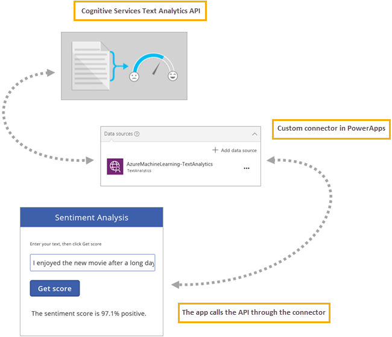
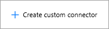
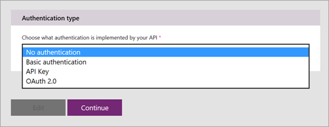
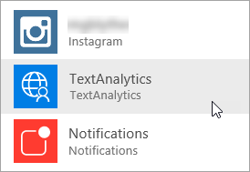
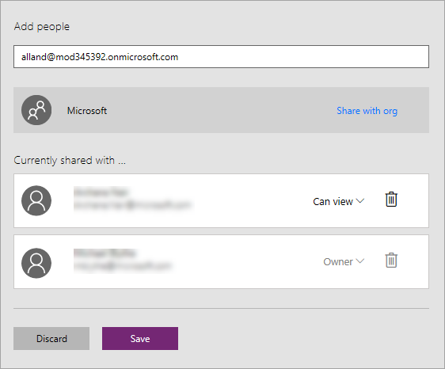

# <a name="register-and-use-custom-connectors-in-powerapps"></a>Registrieren und Verwenden von benutzerdefinierten Connectors
Mithilfe von PowerApps können Sie Apps mit vollem Funktionsumfang ohne herkömmlichen Anwendungscode erstellen. In einigen Fällen müssen Sie die Möglichkeiten von PowerApps jedoch erweitern, und dafür bieten sich Webdienste in idealer Weise an. Ihre App kann eine Verbindung mit einem Dienst herstellen, Operationen ausführen und Daten zurück erhalten. Wenn Sie über einen Webdienst verfügen, den Sie mit PowerApps verbinden möchten, registrieren Sie den Dienst als benutzerdefinierten Connector. Dieser Vorgang ermöglicht es PowerApps, die Charakteristika Ihrer Web-API zu verstehen, einschließlich der erforderlichen Registrierung, der unterstützten Operationen und der Parameter und Ausgaben für jede dieser Operationen.

In diesem Thema gehen wir auf die für die Registrierung und Verwendung eines benutzerdefinierten Connectors erforderlichen Schritte ein und verwenden die [Textanalyse-API](https://www.microsoft.com/cognitive-services/en-us/text-analytics-api) aus den Azure Cognitive Services als Beispiel. Diese API bestimmt die Sprache, die Stimmung und wichtige Aussagen in den Texten, die Sie ihr übergeben. Das folgende Bild zeigt die Interaktion zwischen dem Dienst, dem benutzerdefinierten Connector, den wir daraus erstellen, und der App, die die API aufruft.



## <a name="prerequisites"></a>Voraussetzungen
* ein [PowerApps-Konto](https://powerapps.microsoft.com)
* Eine OpenAPI-Datei im JSON-Format, eine URL, die auf eine OpenAPI-Definition verweist, oder eine Postman-Sammlung für Ihre API. Wenn Sie über keins dieser Elemente verfügen, geben wir Ihnen Hilfestellung.
* Ein Bild, das Sie als Symbol für Ihren benutzerdefinierten Connector verwenden können (optional).

## <a name="steps-in-the-custom-connector-process"></a>Schritte im Erstellungsprozess für den benutzerdefinierten Connector
Die Erstellung des benutzerdefinierten Connectors erfolgt in mehreren Schritten, die wir unten kurz beschreiben. Dieser Artikel geht von der Annahme aus, dass Sie bereits über eine RESTful-API mit einer Form von authentifiziertem Zugriff verfügen, daher legen wir den Schwerpunkt im restlichen Artikel auf die Schritte 3–6. Ein Beispiel für die Schritte 1 und 2 finden Sie unter [Erstellen einer benutzerdefinierten Web-API für PowerApps](customapi-web-api-tutorial.md).

1. Zunächst müssen Sie in der gewünschten Sprache und für die gewünschte Plattform **eine RESTful-API erstellen**. Für Microsoft-Technologien empfehlen wir eine der folgenden.
   
   * Azure Functions
   * Azure-Web-Apps
   * Azure API-Apps
2. Mithilfe eines der folgenden Authentifizierungsmechanismen können Sie **Ihre API schützen**. Sie können den unauthentifizierten Zugriff auf die API zulassen, es wird von uns aber nicht empfohlen.
   
   * Azure Active Directory. Weitere Informationen finden Sie unter [Verwenden von Azure Active Directory mit einem benutzerdefinierten Connector in PowerApps](customapi-azure-resource-manager-tutorial.md).
   * OAuth 2.0 für bestimmte Dienste, wie Dropbox, Facebook und SalesForce
   * OAuth 2.0 (generisch)
   * API-Schlüssel
   * Standardauthentifizierung
3. Damit PowerApps Verbindungen damit herstellen kann, müssen Sie auf eine von zwei branchenüblichen Weisen **Ihre API beschreiben**.
   
   * Eine OpenAPI-Datei (auch als Swagger-Datei bezeichnet): Sie können eine OpenAPI-Datei auch in Schritt 4 als Teil des Registrierungsvorgangs erstellen.
   * Eine Postman-Sammlung
4. Sie müssen **Ihren benutzerdefinierten Connector registrieren** und verwenden dazu einen Assistenten in PowerApps, wo Sie eine Beschreibung der API, Sicherheitsdetails und weitere Informationen angeben.

5. **Verwenden Sie Ihren benutzerdefinierten Connector** in einer App. Erstellen Sie in der App eine Verbindung mit der API, und rufen Sie die von der API bereitgestellten Operationen auf, ganz so, wie Sie native Funktionen in PowerApps aufrufen.

6. Sie können Ihren **benutzerdefinierten Connector freigeben**, wie Sie andere Datenverbindungen in PowerApps freigeben. Dieser Schritt ist optional, es ist aber häufig sinnvoll, benutzerdefinierte Connectors für mehrere App-Ersteller freizugeben.

## <a name="describe-your-api"></a>Beschreiben Ihrer API
Angenommen, Sie verfügen über eine API mit einer Form von authentifiziertem Zugriff, so benötigen Sie eine Möglichkeit, die API so zu beschreiben, dass PowerApps Verbindungen mit ihr herstellen können. Zu diesem Zweck erstellen Sie eine OpenAPI-Datei oder eine Postman-Sammlung – das können Sie von *jedem* REST-API-Endpunkt aus vornehmen, darunter:

* Öffentlich verfügbare APIs. Beispiele hierfür sind [Spotify](https://developer.spotify.com/), [Uber](https://developer.uber.com/), [Slack](https://api.slack.com/), [Rackspace](http://docs.rackspace.com/) usw.
* Eine API, die Sie erstellen und für einen beliebigen Cloudhostinganbieter bereitstellen, z.B. Azure, Amazon Web Services (AWS), Heroku, Google Cloud usw.
* Eine benutzerdefinierte Branchen-API, die in Ihrem Netzwerk bereitgestellt wird, solange die API im öffentlichen Internet verfügbar gemacht wird.

OpenAPI-Dateien und Postman-Sammlungen verwenden verschiedene Formate, sind jedoch beide sprachunabhängig maschinenlesbare Dokumente, in denen die Operationen und Parameter Ihrer API beschrieben werden:

* Sie können diese Dokumente mithilfe einer Vielzahl von Tools erstellen, abhängig von der Sprache und Plattform, die zur Erstellung Ihrer API verwendet wurden. Ein Beispiel für eine OpenAPI-Datei finden Sie in der [Dokumentation zur Textanalyse-API](https://westus.dev.cognitive.microsoft.com/docs/services/TextAnalytics.V2.0/export?DocumentFormat=Swagger&ApiName=Azure).
* Wenn Sie noch nicht über eine OpenAPI-Datei für Ihre API verfügen und auch keine erstellen möchten, können Sie mithilfe einer Postman-Sammlung trotzdem auf einfache Weise einen benutzerdefinierten Connector erstellen. Weitere Informationen finden Sie unter [Erstellen einer Postman-Sammlung](postman-collection.md).
* PowerApps verwendet letztlich hinter den Kulissen OpenAPI, daher wird eine Postman-Sammlung analysiert und in eine OpenAPI-Definitionsdatei übersetzt.

> [!NOTE]
> Die Dateigröße muss weniger als 1 MB betragen.

### <a name="getting-started-with-openapi-and-postman"></a>Erste Schritte mit OpenAPI und Postman
* Wenn Sie gerade erst in OpenAPI einsteigen, lesen Sie [Erste Schritte mit Swagger](http://swagger.io/getting-started/) (Getting Started with OpenAPI) auf der swagger.io-Website.
* Wenn Sie in Postman einsteigen, installieren Sie die [Postman-App](https://www.getpostman.com/apps) von der Postman-Website.
* Wenn Ihre API mit Azure API-Apps oder Azure Functions erstellt wurde, finden Sie weitere Informationen unter [Exportieren einer in Azure gehosteten API in PowerApps und Microsoft Flow](https://docs.microsoft.com/azure/app-service/app-service-export-api-to-powerapps-and-flow).

## <a name="register-your-custom-connector"></a>Registrieren des benutzerdefinierten Connectors
Jetzt verwenden Sie die OpenAPI-Datei oder die Postman-Sammlung, um Ihren benutzerdefinierten Connector in PowerApps zu registrieren.

1. Wählen Sie in [powerapps.com](https://web.powerapps.com) im linken Menü **Verbindungen** aus. Wählen Sie die Auslassungspunkte (**...**) und dann in der oberen rechten Ecke **Benutzerdefinierte Connectors verwalten** aus.
   
     > [!TIP]
> Wenn Sie die Option zum Verwalten benutzerdefinierter Connectors in einem mobilen Browser nicht finden können, befindet sie sich möglicherweise unter einem Menü in der oberen linken Ecke.
   
      
2. Wählen Sie **Benutzerdefinierten Connector erstellen** aus.
   
    
3. Wählen Sie auf der Registerkarte **Allgemein** aus, wie Sie den benutzerdefinierten Connector erstellen möchten.
   
   * Hochladen einer OpenAPI-Datei

   * Verwenden einer OpenAPI-URL

   * Hochladen von Postman Collection V1
     
     
     
     Laden Sie ein Symbol für den benutzerdefinierten Connector hoch. Die Felder „Beschreibung“, „Host“ und „Basis-URL“ werden normalerweise automatisch aus den Informationen aus der OpenAPI-Datei aufgefüllt. Wenn sie nicht automatisch aufgefüllt werden, können Sie diesen Feldern Informationen hinzufügen. Wählen Sie **Weiter** aus.
4. Geben Sie auf der Registerkarte **Sicherheit** alle Authentifizierungseigenschaften ein.
   
    
   
   * Der Authentifizierungstyp wird automatisch auf der Grundlage der Definition in Ihrem OpenAPI-Objekt `securityDefinitions` aufgefüllt. Unten finden Sie ein OAuth2.0-Beispiel.
     
       ```
       "securityDefinitions": {
           "AAD": {
           "type": "oauth2",
           "flow": "accessCode",
           "authorizationUrl": "https://login.windows.net/common/oauth2/authorize",
           "scopes": {}
           }
       },
       ```
   * Wenn die OpenAPI-Datei das `securityDefintions`-Objekt nicht verwendet, werden keine weiteren Werte benötigt.
   * Wenn eine Postman-Sammlung verwendet wird, wird der Authentifizierungstyp nur bei unterstützten Authentifizierungstypen automatisch aufgefüllt, wie OAuth 2.0 oder Standardauthentifizierung.
   * Ein Beispiel zur Einrichtung von AAD-Authentifizierung (Azure Active Directory) finden Sie unter [Erstellen einer benutzerdefinierten Web-API für PowerApps](customapi-web-api-tutorial.md#set-up-azure-active-directory-authentication).
5. Auf der Registerkarte **Definitionen** werden alle in Ihre OpenAPI-Datei oder Postman-Sammlung definierten Operationen, zusammen mit den Anforderungs- und Antwortwerten, automatisch aufgefüllt. Wenn alle erforderlichen Operationen definiert sind, können Sie mit Schritt 6 im Registrierungsprozess fortfahren, ohne Änderungen auf diesem Bildschirm vorzunehmen.
   
    
   
    Wenn Sie vorhandene Aktionen bearbeiten oder Ihrem benutzerdefinierten Connector neue Aktionen hinzufügen möchten, lesen Sie weiter.
   
   1. Wenn Sie eine neue Aktion hinzufügen möchten, die noch nicht in Ihrer OpenAPI-Datei oder Postman-Sammlung definiert wurde, wählen Sie im linken Bereich **Neue Aktion** aus, und setzen Sie im Abschnitt **Allgemein** den Namen, die Beschreibung und die Sichtbarkeit Ihrer Operation ein.
   2. Wählen Sie im Abschnitt **Anfordern** oben rechts **Aus Beispiel importieren** aus. Fügen Sie im Formular rechts eine Beispielanforderung ein. Beispielanforderungen stehen normalerweise in der Dokumentation der API zur Verfügung, wo Sie Informationen zum Ausfüllen der Felder **Aktionsart**, **Anforderungs-URL**, **Header** und **Textkörper** abrufen können. Ein Beispiel finden Sie in der [Dokumentation zur Textanalyse-API](https://westus.dev.cognitive.microsoft.com/docs/services/TextAnalytics.V2.0/operations/56f30ceeeda5650db055a3c6).
      
       

   3. Wählen Sie **Importieren** aus, um die Anforderungsdefinition abzuschließen. Definieren Sie die Antwort auf ähnliche Weise.
6. Nachdem Sie alle Operationen definiert haben, wählen Sie **Erstellen** aus, um Ihren benutzerdefinierten Connector zu erstellen.
7. Sobald Sie Ihren benutzerdefinierten Connector erstellt haben, wechseln Sie zur Registerkarte **Test**, um die in der API definierten Operationen zu testen. Wählen Sie eine Verbindung aus, und geben Sie Eingabeparameter ein, um eine Operation zu testen.
   
    
   
    Wenn der Aufruf erfolgreich ist, erhalten Sie eine gültige Antwort.
   
    

## <a name="use-your-custom-connector"></a>Verwenden des benutzerdefinierten Connectors
Fügen Sie nach der erfolgten Registrierung Ihrer API den benutzerdefinierten Connector hinzu, ganz wie eine beliebige andere Datenquelle. Wir stellen hier schrittweise ein kurzes Beispiel vor. Weitere Informationen zu Datenverbindungen finden Sie unter [Hinzufügen einer Datenverbindung in PowerApps](add-data-connection.md).

1. Klicken oder tippen Sie in PowerApps Studio im rechten Bereich auf **Datenquelle hinzufügen**.
   
    
2. Klicken oder tippen Sie auf den erstellten benutzerdefinierten Connector.
   
    
3. Führen Sie alle für die Anmeldung beim gewünschten Dienst erforderlichen Schritte aus. Wenn Ihre API OAuth-Authentifizierung verwendet, wird Ihnen möglicherweise ein Anmeldebildschirm angezeigt. Bei der API-Schlüssel-Authentifizierung werden Sie möglicherweise zur Eingabe eines Schlüsselwerts aufgefordert.
4. Rufen Sie die API in Ihrer App auf. Für das Beispiel haben wir eine App erstellt, die Text an Cognitive Services übergibt und einen Stimmungswert zwischen 0 und 1 zurück erhält, der von der App als Prozentwert angezeigt wird.
   
   * Wenn Sie bei diesem Connector mit der Eingabe von „Az“ in der Bearbeitungsleiste beginnen, werden die API und die von ihr verfügbar gemachten Operationen angezeigt.
     
       
   * Der vollständige Aufruf sieht wie folgt aus, wobei wir Text aus dem `TextInput`-Steuerelement übergeben und einen Punktwert zum Anzeigen in der App zurück erhalten:
     
       ```
       'AzureMachineLearning-TextAnalytics'.Sentiment({documents:Table({language:"en",id:"1",text:TextInput.Text})}).documents.score)
       ```
   * Wir führen weitere Arbeiten in der App aus, um die zurück erhaltenen Daten zu verarbeiten, das ist aber nicht allzu kompliziert.

Die fertig gestellte App sieht wie in der folgenden Abbildung dargestellt aus. Es ist eine einfache App, sie erhält aber durch die Möglichkeit, Cognitive Services mithilfe eines benutzerdefinierten Connectors aufzurufen, leistungsstarke Funktionen.


### <a name="quota-and-throttling"></a>Kontingent und Drosselung
* Details zu Kontingenten für die Erstellung von benutzerdefinierten Connectors finden Sie auf der Seite [PowerApps – Preise](https://powerapps.microsoft.com/pricing/). Benutzerdefinierte Connectors, die für Sie freigegeben wurden, werden nicht auf dieses Kontingent angerechnet.
* Für jede Verbindung, die auf einem benutzerdefinierten Connector erstellt wird, können Benutzer bis zu 500 Anforderungen pro Minute vornehmen.

## <a name="share-your-custom-connector"></a>Freigeben Ihres benutzerdefinierten Connectors
Da Sie jetzt über einen benutzerdefinierten Connector verfügen, können Sie ihn für andere Benutzer in Ihrer Organisation freigeben. Beachten Sie beim Freigeben von APIs, dass andere Benutzer in Abhängigkeit von diesen geraten können und das Löschen eines benutzerdefinierten Connectors alle Verbindungen mit der API entfernt. Informationen zum Bereitstellen von Connectors für Benutzer außerhalb Ihrer Organisation finden Sie unter [Übersicht zum Zertifizieren von benutzerdefinierten Connectors in PowerApps](api-connector-overview.md) (Overview of certifying custom connectors in PowerApps).

1. Wählen Sie in [powerapps.com](https://web.powerapps.com) im linken Menü **Verbindungen** aus. Wählen Sie die Auslassungspunkte (**...**) und dann in der oberen rechten Ecke **Benutzerdefinierte Connectors verwalten** aus.
   
    
2. Wählen Sie die Schaltfläche mit den Auslassungspunkten (**. . .**) für Ihren Connector aus, und wählen Sie dann **Eigenschaften anzeigen** aus.  
   
    
3. Wählen Sie Ihre API aus, wählen Sie die Option **Freigeben**, und geben Sie dann die Benutzer oder Gruppen ein, denen Sie Zugriff auf Ihre API gewähren möchten.  
   
    
4. Wählen Sie **Speichern**.

## <a name="next-steps"></a>Nächste Schritte
[Informationen zum Erstellen einer Postman-Sammlung](postman-collection.md)

[Use an ASP.NET Web API](customapi-web-api-tutorial.md) (Verwenden einer ASP.NET-Web-API)

[Register an Azure Resource Manager API](customapi-azure-resource-manager-tutorial.md) (Registrieren einer Azure Resource Manager-API)

