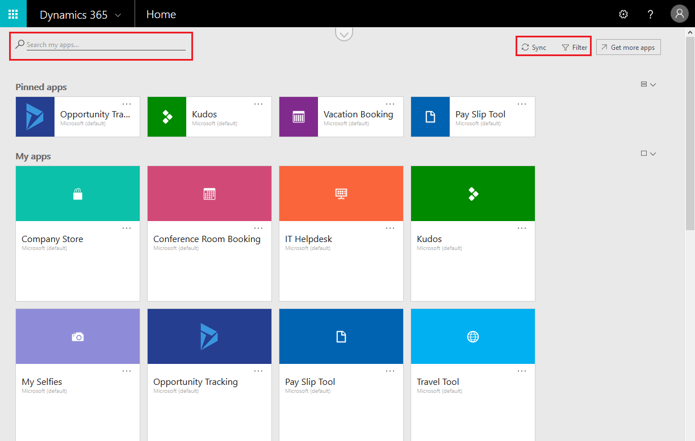
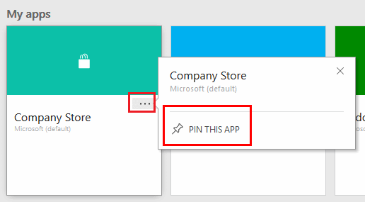
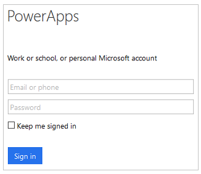

# Verwenden von PowerApps in einem Webbrowser
Wenn Sie eine App in PowerApps erstellen, können Sie diese App in einem Browser ausführen, indem Sie [Dynamics 365](https://home.dynamics.com) öffnen und auf der Startseite auf die Kachel für die App klicken oder tippen.

**Hinweis**: Lesen Sie die allgemeinen Informationen zu [Microsoft Dynamics 365](https://docs.microsoft.com/en-us/dynamics365/), oder wenden Sie sich an den [Support](https://www.microsoft.com/en-us/dynamics365/contact-us), wenn Sie eine Frage zu einer Dynamics 365-App haben (z.B. zum Vertrieb).

Die folgenden Browser und Betriebssysteme werden unterstützt:

| **Browser** | **Betriebssystem** |
| --- | --- |
| Google Chrome (aktuelle Version) |Windows 7 SP1, 8.1 und 10  macOS  iOS 8 oder höher Android |
| Microsoft Edge |Windows 10 |
| Microsoft Internet Explorer 11 (mit deaktivierter Kompatibilitätsansicht) |Windows 7 SP1, 8.1 und 10 |
| Mozilla Firefox (aktuelle Version) |Windows 7 SP1, 8.1 und 10   Android  macOS |
| Apple Safari (aktuelle Version) |macOS   iOS 8 oder höher |

Wenn Ihr Browser nicht alle in der App verwendeten Steuerelemente unterstützt, verwenden Sie die App auf einem mobilen Gerät (z.B. auf einem Telefon). Laden Sie hierzu PowerApps Mobile für iOS, Android oder Windows herunter.

## Finden einer App auf der Startseite
Die Startseite zeigt möglicherweise verschiedene Arten von Geschäfts-Apps an. Sie können nach einer bestimmten App suchen, indem Sie einen Teil des App-Namens in das Suchfeld eingeben. Sie können die Liste außerdem filtern, um nur die Apps anzuzeigen, die in PowerApps erstellt wurden.

Wenn Sie eine App erst vor Kurzem installiert haben, wird sie möglicherweise nicht sofort in der Liste der Apps angezeigt. Klicken oder tippen Sie auf **Synchronisieren**, um all Ihre Apps anzuzeigen. Dieser Vorgang kann bis zu einer Minute in Anspruch nehmen.

## Öffnen einer App aus dem Aufgabenbereich
Nachdem Sie die gewünschte App gefunden haben, können Sie sie für einen einfacheren Zugriff an den Aufgabenbereich anheften. Um eine App anzuheften, klicken oder tippen Sie auf die Auslassungspunkte (...) auf der App-Kachel. Klicken oder tippen Sie anschließend auf **Diese App anheften**.

Die App wird anschließend im Aufgabenbereich unter **Meine Apps** angezeigt, den Sie öffnen, indem Sie oben links auf **Dynamics 365** klicken oder tippen.

## Öffnen einer App über eine URL
Sie können die URL einer App auch als Lesezeichen im Browser speichern oder als Link per E-Mail senden. Wenn eine andere Person eine App in PowerApps erstellt und diese App für Sie freigegeben hat, können Sie diese App ausführen, indem Sie auf den Link in der E-Mail klicken oder tippen, die Sie erhalten haben. In jedem dieser Fälle werden Sie aufgefordert, sich mit Ihren Azure Active Directory-Anmeldeinformationen anzumelden.

## Herstellen einer Datenverbindung
Wenn die App eine Verbindung mit einer Datenquelle oder eine Zustimmung zur Verwendung von Gerätefunktionen erfordert, wird eine Eingabeaufforderung angezeigt, bevor Sie die App verwenden können:  

Normalerweise werden Sie nur beim ersten Mal aufgefordert.

## Schließen einer App
Melden Sie sich auf der Dynamics 365-Startseite ab, um die App zu schließen, oder öffnen Sie eine andere App.

