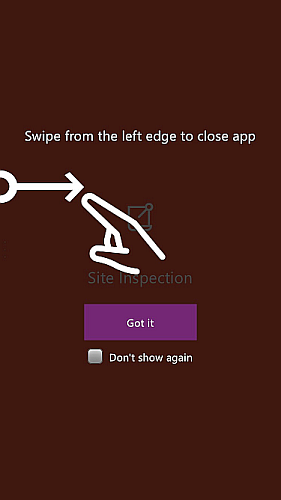
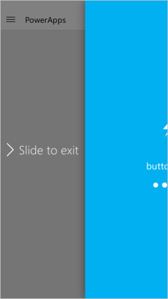

# Verwenden von PowerApps auf einem Smartphone oder Tablet
Mithilfe von PowerApps erstellte Apps können unter Windows, iOS, Android, Windows Phone oder in einem Webbrowser ausgeführt werden. Apps, die auf mobilen Geräten ausgeführt werden, können die Möglichkeiten des Geräts nutzen, wie etwa Standort und Kamera. Sie können PowerApps Mobile aus dem Windows Store, dem App Store oder von Google Play herunterladen.

## Das benötigen Sie, um anzufangen
* Eins der folgenden Elemente:
  * Eine App, die Sie aus einer [Vorlage](get-started-test-drive.md), aus [Daten](get-started-create-from-data.md) oder ausgehend von einer [leeren Zeichnungsfläche](get-started-create-from-blank.md) erstellt haben.
  * Eine App, die von einer anderen Person erstellt und für Sie mit erteilten Benutzerberechtigungen freigegeben wurde.
* PowerApps auf einem iPhone, iPad, Windows Phone oder einem Android-Gerät installiert. Im Folgenden finden Sie die angegebenen Versionen, die unterstützt werden:  
  * iOS-Version 9.3 und höher
  * Android-Version 5 und höher
  * Windows 10 Mobile (Vorschau)

Wenn Sie mit PowerApps nicht vertraut sind, finden Sie Grundlagen unter [Einführung in PowerApps](getting-started.md).

## Anmelden bei PowerApps
Wenn Sie PowerApps zum ersten Mal öffnen, werden Sie aufgefordert, sich mit Ihren Anmeldeinformationen von Azure Active Directory anzumelden:  

## Windows 10 Mobile Vorschau
PowerApps für Windows 10 Mobile ist im Store als Vorschau verfügbar. Alternativ können Sie zu [powerapps.com](https://powerapps.microsoft.com/) navigieren; dort finden Sie unten auf der Seite einen Link zum Windows Store.

Es gelten diese Systemanforderungen:

* **Betriebssystem**: Jubiläumsupdate Redstone 1 (10.0.14267.1002) oder höher erforderlich
* **Arbeitsspeicher**: mindestens 2GB RAM

## Filter- und Sortieroptionen für Apps
Durchsuchen Sie eine dieser Kategorien, um eine App schnell zu finden:

* **Alle**: Alle Apps, auf die Sie Zugriff haben, einschließlich von Ihnen erstellte Apps und Apps, die andere für Sie freigegeben haben.
* **Meine Apps**: Apps, die Sie wenigstens einmal ausgeführt haben.
* **Beispiele**: Beispiel-Apps, die von Microsoft bereitgestellt wurden, um echte Anwendungsszenarien mit fiktiven Daten vorzustellen und Sie beim Erforschen von Entwurfsmöglichkeiten zu unterstützen.
* **Favoriten**: Apps, die Sie mithilfe der Option "…" der einzelnen Apps gekennzeichnet haben. Sie können die Kennzeichnung einer App aufheben, um sie aus dieser Liste zu entfernen.
  
    

Nach dem Auswählen können Sie eine Liste nach dem Datum des letzten Öffnens oder der letzten Änderung sortieren. Diese Einstellungen werden beibehalten, wenn Sie PowerApps schließen und erneut öffnen.  

## Öffnen einer App
Um eine App auf einem Tablet oder einen Smartphone zu öffnen, tippen Sie auf das App-Symbol, oder tippen Sie auf die Pushbenachrichtigung, die angezeigt wird, wenn jemand eine App für Sie freigibt.

Wenn Sie PowerApps zu ersten Mal verwenden, stellt ein Bildschirm die Wischgeste zum Beenden von PowerApps dar.

## Erteilen der Zustimmung
Wenn eine App eine Verbindung mit einer Datenquelle oder die Zustimmung zur Nutzung von Funktionen des Geräts erfordert, müssen Sie die Verbindung bestätigen oder Ihre Zustimmung erteilen, bevor Sie die App verwenden:  

Normalerweise werden Sie nur beim ersten Mal aufgefordert.

## Beenden der App
* Wischen Sie auf einem Android-Smartphone nach rechts (oder drücken Sie die Schaltfläche „Zurück“, und bestätigen Sie, dass Sie die App beenden möchten).
* Wischen Sie auf einem iPhone nach rechts.
* Drücken Sie unter Windows 10 Mobile die Zurück-Taste.

## Freigeben der App
Informationen zum Freigeben einer App unter [powerapps.com](https://web.powerapps.com) finden Sie unter [Freigeben von Apps](share-app.md).

## Anheften einer App an den Startbildschirm
Wenn Sie eine App heruntergeladen und mindestens einmal verwendet haben, können Sie sie zum schnellen Zugriff an den Startbildschirm Ihres Geräts anheften. Tippen Sie auf die Auslassungspunkte (...) für eine App, tippen Sie auf **Anheften**, und folgen Sie den Anweisungen, die dann angezeigt werden.

