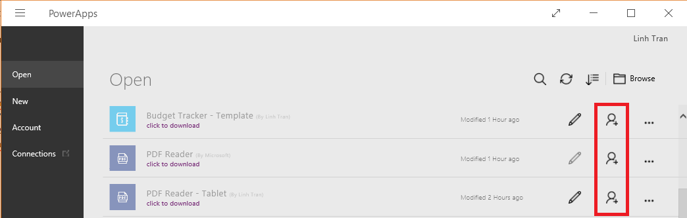
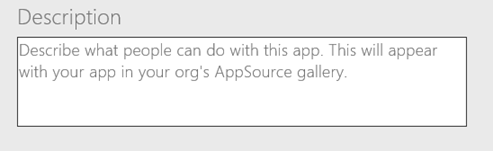

# Freigeben einer Apps in PowerApps
Sie können mit PowerApps Apps erstellen, die genau auf die Anforderungen Ihres eigenen Unternehmens abgestimmt sind, aber die eigentliche Stärke von PowerApps liegt darin, dass Sie diese Apps für andere Personen freigeben können. In diesem Thema erfahren Sie, wie Sie Apps für bestimmte Benutzer oder Sicherheitsgruppen oder für Ihre gesamte Organisation freigeben.

## Öffnen des Bildschirms zur App-Freigabe
Um eine App freizugeben, müssen Sie powerapps.com öffnen. Das Freigeben von Apps in PowerApps Studio oder PowerApps Mobile wird nicht mehr unterstützt.

**Aus PowerApps Studio**

* Option 1: Klicken oder tippen Sie im Menü **Datei** auf **Freigeben**.
  
    
* Option 2: Klicken oder tippen Sie im Menü **Datei** auf **Öffnen**, und klicken oder tippen Sie dann auf das Symbol für eine App.
  
    

**Aus [powerapps.com](http://web.powerapps.com)**

* Klicken oder tippen Sie in der linken Navigationsleiste auf **Apps**, klicken oder tippen Sie auf die Auslassungspunkte (...), und klicken oder tippen Sie anschließend auf **Freigeben**.
  
   

## Freigeben einer App
Von hier aus können Sie eine App freigeben, indem Sie die folgenden Schritte ausführen.

1. Geben Sie den Namen von mindestens einem Benutzer oder einer Sicherheitsgruppe in Azure Active Directory an, oder geben Sie an, dass Sie die App für Ihre gesamte Organisation freigeben möchten. Beachten Sie, dass Sie die Freigabe nur mit der Berechtigung **Benutzer** durchführen können, wenn Sie die App für Ihre gesamte Organisation freigeben.
   
    
2. Geben Sie die Berechtigungsebene an:
   
   * **Benutzer**: Benutzer oder Gruppen können die App ausführen, aber nicht freigeben.
   * **Mitwirkender**: Benutzer und Gruppen können die App ausführen, anpassen und die benutzerdefinierte Version für andere Benutzer freigeben.
     
       
3. Klicken oder tippen Sie auf **Speichern**.

Um die Berechtigungen für einen Benutzer oder für Gruppen zu ändern, wiederholen Sie Schritt 1 dieser Prozedur, und geben Sie anschließend eine andere Option in der Liste der Berechtigungen für diesen Benutzer oder diese Gruppe an. Um einen Benutzer oder einer Gruppe alle Berechtigungen zu entziehen, klicken oder tippen Sie auf das Symbol **x** für diesen Benutzer oder diese Gruppe.

### Senden einer E-Mail-Benachrichtigung
Wenn Sie eine App freigeben, können Sie auswählen, ob Benutzer oder Sicherheitsgruppen per E-Mail benachrichtigt werden sollen. Wenn Sie diese Option auswählen, wird den Benutzern oder Sicherheitsgruppen eine E-Mail-Benachrichtigung gesendet. Die E-Mail enthält einen Link für den Zugriff auf die App. Gegebenenfalls werden Benutzer dazu aufgefordert, sich zu registrieren und PowerApps zu installieren.

Beachten Sie, dass abhängig von den erteilten Freigabeberechtigungen für die App unterschiedliche E-Mail-Vorlagen gesendet werden. Wenn Sie die App mit der Berechtigung **Benutzer** freigeben, enthält die E-Mail den Link zum Ausführen der App. Wenn Sie die App mit der Berechtigung **Mitwirkender** freigeben, enthält die E-Mail einen Link zum Bearbeiten der App in PowerApps Studio oder zum Ausführen der App.

### Wie wird meinen Benutzern die freigegebene App angezeigt?
Nachdem Sie eine App für mindestens einen Benutzer oder eine Sicherheitsgruppe freigegeben haben, legt die Freigabeberechtigung fest, wie Benutzern die freigegebene App angezeigt wird.

##### Wenn Sie die App mit der Berechtigung *Benutzer* freigegeben haben
Die Personen, für die Sie die App freigegeben haben, erhalten eine E-Mail-Benachrichtigung, wenn Sie dieses Kontrollkästchen auf dem Bildschirm für die App-Freigabe aktiviert haben. In der E-Mail können die Benutzer auf einen Link klicken oder tippen, um die App in [Dynamics 365](http://home.dynamics.com) auszuführen. In Kürze werden universelle Links unterstützt. Dies bedeutet, dass die App in PowerApps Studio oder PowerApps Mobile geöffnet wird, wenn diese Anwendungen installiert sind.

Benutzer können die App auch in AppSource in [Dynamics 365](http://home.dynamics.com) ermitteln (wenn Sie beispielsweise keine E-Mail gesendet haben). [Erfahren Sie mehr darüber](app-source.md), wie Benutzer Apps über AppSource abrufen können.

##### Wenn Sie eine App mit der Berechtigung *Mitwirkender* freigegeben haben
Die Personen, für die Sie die App freigegeben haben, erhalten eine E-Mail-Benachrichtigung, wenn Sie dieses Kontrollkästchen auf dem Bildschirm für die App-Freigabe aktiviert haben. In der E-Mail können sie auf einen Link klicken oder tippen, der die App unter Verwendung von PowerApps Studio für das Web direkt für die Bearbeitung öffnet. Es ist auch ein Link zum Ausführen der App in [Dynamics 365](http://home.dynamics.com) vorhanden. In Kürze werden universelle Links unterstützt. Dies bedeutet, dass die App in PowerApps Studio oder PowerApps Mobile geöffnet wird, wenn diese Anwendungen installiert sind.

Benutzer können die App auch in [powerapps.com](http://web.powerapps.com) ermitteln (wenn Sie beispielsweise keine E-Mail gesendet haben). Dies ist der Startpunkt für App-Ersteller, um alle Apps zu suchen, die sie erstellt haben oder die mit der Berechtigung **Mitwirkender** für sie freigegeben wurden. Über [Dynamics 365](http://home.dynamics.com) hingegen können Benutzer Apps aus PowerApps oder andere Geschäftsanwendungen schnell ausführen.

## Weitere wichtige Informationen
* Um eine App freizugeben, müssen Sie sie nicht lokal, sondern in der Cloud speichern.
* Bevor Sie eine App freigeben, sollten Sie überlegen, für welche Benutzer und Sicherheitsgruppen Sie die App freigeben möchten und welche Rolle konfiguriert werden soll – Benutzer oder Mitwirkender. Wenn Sie eine App für eine Gruppe, bestehende Mitglieder dieser Gruppe und jeden, der dieser Gruppe beitritt, freigeben, verfügen alle über die von Ihnen angegebenen Berechtigungen. Jeder, der die Gruppe verlässt, verliert diese Berechtigungen, es sei denn, diese Personen sind Mitglieder einer anderen Gruppe, die über Zugriff verfügt, oder Sie gewähren ihnen explizit Berechtigungen.
* Jedes Mitglied einer Gruppe besitzt dieselben Berechtigungen für eine App wie die Gruppe allgemein. Sie können allerdings für ein Mitglied oder mehrere Mitglieder dieser Gruppe tiefgreifendere Berechtigungen angeben, um diesen Personen besseren Zugriff zu gewähren. Beispiel: Sie geben eine App für die Sicherheitsgruppe A mit der Berechtigung „Benutzer“ frei. Jedes Mitglied der Sicherheitsgruppe A kann die App ausführen. Jetzt geben Sie die App für den Benutzer B mit der Berechtigung „Mitwirkender“ frei. Benutzer B ist gleichzeitig Mitglied der Sicherheitsgruppe A. Benutzer B kann die App jetzt auch bearbeiten, während alle anderen Mitglieder der Sicherheitsgruppe A die App nur verwenden können. Wenn Sie für ein Mitglied oder mehrere Mitglieder weniger Berechtigungen angeben, verfügen diese Personen noch immer über alle Berechtigungen, die Sie der gesamten Gruppe zugewiesen haben.
* Sie können eine App für Ihre gesamte Organisation freigeben, aber Sie sollten vorher sorgfältig prüfen, ob alle Benutzer Zugriff auf Ihre App benötigen.
* Beachten Sie, dass alle Änderungen, die Sie an einer freigegebenen App vornehmen, beim Speichern der Änderungen sofort an die Personen weitergegeben werden, für die die App freigegeben wurde. Dies kann von Vorteil sein, wenn Sie Verbesserungen an der App vornehmen, es kann für die anderen aber auch nachteilig sein, wenn Sie Funktionen entfernen oder erheblich ändern.
* Geben Sie vor der Freigabe einen aussagekräftigen Namen und eine Beschreibung für die App an. So können die Benutzer erkennen, um was für eine App es sich handelt, und sie in einer Liste auswählen. Klicken oder tippen Sie im Menü **Datei** in PowerApps Studio auf **App-Einstellungen**, und geben Sie eine Beschreibung ein.
  
  

### App-Freigabe und von der App verwendete Ressourcen
Die meisten Apps stützen sich zumindest auf einen dieser Ressourcentypen:

* eine Verbindung mit einer Datenquelle
* ein lokales Datengateway
* ein benutzerdefinierter Connector
* eine Excel-Arbeitsmappe oder einen anderen Dienst
* einen Flow

Benutzer und Mitwirkende benötigen Berechtigungen für alle Datenverbindungen und Gateways, die von einer App verwendet werden. Einige Berechtigungen werden implizit in der App gewährt, andere müssen explizit zugewiesen werden. Weitere Informationen finden Sie unter [Freigeben von App-Ressourcen](share-app-resources.md).

Wenn Sie eine App freigeben, die Common Data Service verwendet, wird in der Informationsleiste angezeigt, dass Sie die Laufzeitberechtigung für Common Data Service separat erteilen müssen. Wenn Sie hierzu nicht berechtigt sind, wenden Sie sich an Ihren Umgebungsadministrator. [Erfahren Sie mehr](database-security.md) über die Sicherheit für Common Data Service.

### Was wird nicht unterstützt?
* Sie können eine Freigabe für eine Sicherheitsgruppe durchführen, nicht jedoch für eine Verteilergruppe.
* Sie können Apps für Benutzer in Ihrer Organisation freigeben, nicht jedoch für Benutzer in einem anderen Mandanten.
* Sie können eine App aus [powerapps.com](http://web.powerapps.com) freigeben, nicht jedoch über PowerApps Studio. (Klicken oder tippen Sie auf ein Freigabesymbol in PowerApps Studio, um [powerapps.com](http://web.powerapps.com) zu öffnen.)
* Sie können eine App erneut freigeben, wenn Sie über die Berechtigung „Mitwirkender“ (nicht „Benutzer“) für diese App verfügen.

