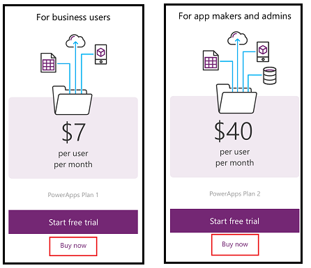

# Erwerb von PowerApps für Ihre Organisation
In diesem Artikel erfahren Sie, wie Sie PowerApps für Ihre Organisation als Administrator erwerben können. Sie können PowerApps direkt über die PowerApps-Website, über das Office 365 Admin Center oder über Ihren Microsoft-Vertreter oder Partner erwerben. Dieser Artikel behandelt die für PowerApps Plan 1 oder Plan 2 verfügbaren Testoptionen und erläutert dann den Erwerb von PowerApps Plan 1 oder Plan 2 als Organisation. Weitere Informationen finden Sie unter [PowerApps in your organization Q&A (PowerApps in Ihrer Organisation F&A)](signup-question-and-answer.md).

> **HINWEIS**   Um PowerApps für eine Organisation zu erwerben, müssen Sie bereits ein globaler Office 365- oder Abrechnungsadministrator eines Mandanten sein oder einen Mandanten erstellen.
> 
> 

## Auswählen des richtigen Plans
Informationen über die Lizenzen, die für Ihre Organisation zur Wahl stehen, finden Sie unter [PowerApps-Lizenzierungsübersicht](pricing-billing-skus.md).

## Direkter Erwerb von PowerApps
Sie können PowerApps-Abonnements für Ihr Unternehmen auf [powerapps.microsoft.com][4] erwerben und anschließend Ihren Benutzern PowerApps-Lizenzen zuweisen. [Weitere Informationen][5]

1. Öffnen Sie [powerapps.microsoft.com][4], und wählen Sie anschließend **Preise** aus.
2. Wählen Sie für den gewünschten Plan **Jetzt kaufen** aus.
   
    
3. Geben Sie Informationen an, um den Kauf abzuschließen, und navigieren Sie anschließend zum [Office 365 Admin Center][6], um Ihren Benutzern PowerApps-Lizenzen zuzuweisen.

## PowerApps über Office 365 erwerben
Sie können PowerApps-Abonnements für Ihr Unternehmen im [Office 365 Admin Center][6] erwerben und anschließend Ihren Benutzern PowerApps-Lizenzen zuweisen. [Weitere Informationen][5]

> **HINWEIS** PowerApps werden vorhandenen und neuen Office 365-Abonnements beginnend ab Ende November 2016 hinzugefügt.
> 
> * Wenn Sie sich mit einem Office 365-Abonnement bei PowerApps anmelden, bevor diese Änderung implementiert wurde, werden Sie aufgefordert, sich für eine kostenlose PowerApps Plan 2-Testversion zu registrieren.
> * Registrieren Sie sich ruhig für die Testversion, wenn Sie PowerApps ausprobieren möchten, bevor das Update Ihres Office 365-Abonnements erfolgt.  
> * Seien Sie sich jedoch bitte bewusst, dass die Testlizenz möglicherweise Features von PowerApps enthält, die nach dem Ablauf der Testversion nach 90 Tagen nicht in Ihrem Office 365-Abonnement enthalten sind.  Unter [PowerApps-Preise][2] erfahren Sie, welche Funktionen in Ihrem Office 365-Abonnement enthalten sind.
> 
> 

### Erwerb einer Abonnementtestversion
1. Navigieren Sie zum [Office 365 Admin Center][6].
2. Wählen Sie im linken Navigationsbereich **Abrechnung > Abonnements** aus.
3. Wählen Sie auf der rechten Seite **+ Abonnements hinzufügen** aus.
4. Zeigen Sie unter **Andere Pläne** mit dem Mauszeiger auf die Auslassungspunkte (...) für den gewünschten Plan, und wählen Sie dann **Kostenlose Testversion starten** aus.
   
    
5. Wählen Sie auf dem Bestätigungsbildschirm **Jetzt testen** aus.

Unter **Abrechnung > Abonnements** wird **Microsoft PowerApps Plan 1-Testversion** oder **Microsoft PowerApps Plan 2-Testversion** mit 100 verfügbaren Lizenzen aufgelistet. Ihre kostenlose Testversion ist 90 Tage lang gültig.

### Erwerb eines Abonnements
1. Navigieren Sie zum [Office 365 Admin Center][6].
2. Wählen Sie im linken Navigationsbereich **Abrechnung > Abonnements** aus.
3. Wählen Sie auf der rechten Seite **+ Abonnements hinzufügen** aus.
4. Zeigen Sie unter **Andere Pläne** mit dem Mauszeiger auf die Auslassungspunkte (...) für den gewünschten Plan, und wählen Sie dann **Jetzt kaufen** aus.
   
    
5. Geben Sie die Anzahl der Lizenzen ein, die Sie hinzufügen möchten, und wählen Sie dann **Jetzt auschecken** oder **In den Einkaufswagen** aus.
   
   > **HINWEIS** Sie können später bei Bedarf weitere Lizenzen hinzufügen.
   > 
   > 
6. Geben Sie die erforderlichen Informationen in den Auscheck-Flow ein,

Unter **Abrechnung > Abonnements** wird **Microsoft PowerApps Plan 1** oder **Microsoft PowerApps Plan 2** aufgelistet. Wenn Sie später entscheiden, dass Sie weitere Lizenzen hinzufügen möchten, kehren Sie zu **Abonnements hinzufügen** zurück, und wählen Sie dann **Lizenzanzahl ändern** aus.

## Add-Ons
Diese sind in Kürze verfügbar, werden aber noch nicht unterstützt.

## Siehe auch
[PowerApps in your organization Q&A (PowerApps in Ihrer Organisation Q&A)](signup-question-and-answer.md)  
[Self-Service-Registrierung für PowerApps](signup-for-powerapps.md)  

<!--Reference links in article-->
[1]: http://go.microsoft.com/fwlink/p/?LinkId=715583
[2]: http://go.microsoft.com/fwlink/p/?LinkId=708209
[4]: https://go.microsoft.com/fwlink/?linkid=832551
[5]: https://support.office.com/article/997596b5-4173-4627-b915-36abac6786dc
[6]: https://portal.office.com/admin/default.aspx
