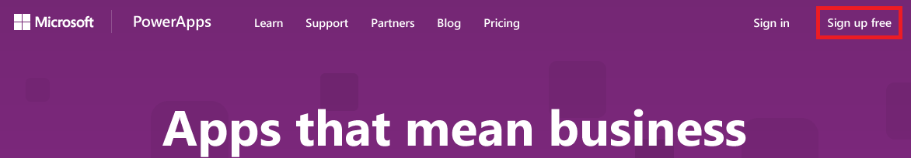
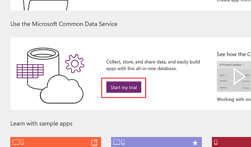

# Self-Service-Registrierung für PowerApps
Das Registrieren für PowerApps als Einzelperson ist ganz einfach! Dieser Artikel führt Sie mit einem kostenlosen Testkonto für PowerApps durch die einzelnen Schritte bis zur Betriebsbereitschaft.

Verwaltungsinformationen finden Sie unter [Erwerben von PowerApps für Ihre Organisation](signup-for-powerapps-admin.md) oder [PowerApps in Ihrer Organisation F&A](signup-question-and-answer.md).

> **HINWEIS** Wenn Sie einer Organisation angehören, ist die Registrierung für Einzelpersonen möglicherweise deaktiviert. Wenn in einem Fehler gemeldet wird, dass die Registrierung deaktiviert wurde, finden Sie weitere Informationen unter [Die Registrierung für Einzelpersonen wurde deaktiviert](#Individual-sign-up-turned-off) (in diesem Thema).
> 
> 

## Welche E-Mail-Adressen können Sie verwenden?
Geben Sie Ihre Geschäfts-, Schul- oder Uni-E-Mail-Adresse ein, um sich bei PowerApps zu registrieren.

> **HINWEIS:** Derzeit werden private E-Mail-Dienste, Telekommunikationsanbieter und E-Mail-Adressen wie die folgenden von Behörden oder dem Militär nicht unterstützt:  
> 
> * outlook.com, hotmail.com, gmail.com usw.  
> * .gov und .mil
> 
> 

Wenn Sie versuchen, sich mit einer privaten E-Mail-Adresse zu registrieren, weist Sie eine Nachricht darauf hin, dass Sie eine Geschäfts-, Schul- oder Uni-E-Mail-Adresse verwenden müssen.

## Zugriff über Office 365 oder Dynamics 365
Ausgewählte Office 365- und Dynamics 365-Pläne umfassen PowerApps, wenn Sie daher bereits über Zugriff verfügen, können Sie sich einfach anmelden. Unter [PowerApps-Preise][3] können Sie herausfinden, ob in Ihrer Lizenz PowerApps enthalten ist.

Wenn Ihr Office 365- oder Dynamics 365-Plan PowerApps beinhaltet, können Sie darauf zugreifen, indem Sie diese Schritte ausführen:

1. Navigieren Sie zu [powerapps.microsoft.com][4], und wählen Sie dann **Anmelden** aus.
   
    
   
    Sie werden anschließend auf [powerapps.com][2] weitergeleitet und können PowerApps gleich verwenden.
   
    

## PowerApps-Plan 2 kostenlos testen
PowerApps bietet kein kostenloses Konto, jedoch können Sie PowerApps-Plan 2 kostenlos für 90 Tage testen. Für die Dauer des Testzeitraums haben Sie Zugriff auf alle Features von PowerApps Plan 2. PowerApps Plan 2 verfügt über sämtliche Features von Plan 1 und außerdem Zugriff auf den Common Data Service und Verwaltungsfeatures. Plan 2 bietet auch eine höhere Kapazität zum Ausführen von Flows und mehr Dateispeicherkapazität im Common Data Service.

### Kostenlose Testversion von Grund auf neu starten
Wenn Sie bereits über Office 365, Dynamics 365 oder PowerApps Plan 1 Zugriff auf PowerApps haben, fahren Sie mit dem nächsten Abschnitt fort. Gehen Sie andernfalls folgendermaßen vor:

1. Navigieren Sie zu [powerapps.microsoft.com][4], und führen Sie dann eine der folgenden Aktionen aus:
   
   * Klicken oder tippen Sie in der Nähe der oberen rechten Ecke auf **Kostenlos registrieren**.
     
       Wenn Sie diese Inhalte auf einem Telefon anzeigen, klicken oder tippen Sie auf das Menüsymbol in der oberen rechten Ecke, und klicken oder tippen Sie auf **Kostenlos registrieren**.
     
       
   * Wählen Sie **Preise** (in der Nähe der Bildschirmmitte) und dann **Kostenlose Testversion starten** aus.
     
     
2. Geben Sie unter **Legen Sie los** Ihre Geschäfts-, Schul- oder Uni-E-Mail-Adresse ein, und klicken oder tippen Sie dann auf **Senden**.  
   
    
3. Wenn Ihr Konto nicht innerhalb einer Organisation vorhanden ist, erhalten Sie eine Nachricht mit der Aufforderung, Ihre E-Mail-Adresse zu überprüfen:
   
    
   
    Wenn Ihr Konto Teil einer vorhandenen Organisation ist, erhalten Sie eine Nachricht mit der Einladung, sich mit diesem Konto anzumelden. Wählen Sie **Anmelden** aus, und melden Sie sich mit Ihrem Geschäftskonto an:  
   
    
4. Wenn Sie eine E-Mail-Nachricht erhalten haben, wählen Sie den Link in der Nachricht aus, um Ihre E-Mail-Adresse zu bestätigen. Nachdem Sie Ihre Adresse verifiziert haben, müssen Sie einige zusätzliche Informationen über sich selbst eingeben.
5. Wenn Sie über ein vorhandenes Organisationskonto verfügen, werden Sie aufgefordert, **Starten** auszuwählen:  
   
6. Sie werden anschließend auf [powerapps.com][2] weitergeleitet und können PowerApps gleich verwenden.
   
    

### Kostenlose Testversion aus PowerApps starten
Wenn Sie als Benutzer von Office 365 bereits Zugriff auf Dynamics 365 oder PowerApps Plan 1 besitzen, können Sie PowerApps Plan 2 kostenlos ausprobieren. Um eine 90 Tage lang gültige kostenlose Testversion von Plan 2 zu starten, melden Sie sich bei PowerApps an, und probieren sie dann eins dieser Features von PowerApps Plan 2 aus:

* [Erstellen und Verwalten von Instanzen](signup-for-powerapps-admin.md) des Common Data Service.
* [Modellieren von Daten](data-platform-intro.md) mithilfe des Common Data Service.
* [Erstellen und Verwalten von Umgebungen](environments-administration.md) über das [PowerApps Admin Center][5].
* [Verwalten eines lokalen Datengateways](gateway-management.md) in PowerApps.  

Wenn Sie eins dieser Features ausprobieren, werden Sie aufgefordert, Ihre kostenlose Testversion zu starten. Wählen Sie einfach **Kostenlose Testversion** aus.

  

Um die Testversion zu starten, müssen Sie den Nutzungsbedingungen zustimmen, indem Sie **Kostenlose Testversion** auswählen.

  

**HINWEISE**

* *Wenn Sie mehr Zeit zum Beurteilen von PowerApps benötigen, können Sie eine Erweiterung Ihres Testzeitraums um weitere 90 Tage anfordern*.
* *Benutzer, die diese im Produkt integrierte Testversion von PowerApps nutzen, werden im Office 365-Administratorportal nicht als PowerApps Plan 2-Testbenutzer aufgeführt (es sei denn, sie besitzen eine weitere Lizenz für Office 365, Dynamics 365 oder PowerApps)*.
* *Wenn Sie als IT-Administrator PowerApps-Testlizenzen für mehrere Benutzer in Ihrer Organisation erwerben möchten, ohne dass die Einzelbenutzer den Vertragsbedingungen zustimmen müssten, können Sie sich für eine [PowerApps Plan 2-Abonnementtestversion][6] registrieren. Sie müssen globaler Office 365-Administrator oder Abrechnungsadministrator sein oder einen neuen Mandanten erstellen, um sich für eine Administratortestversion zu registrieren.*  [Weitere Informationen](signup-for-powerapps-admin.md)

## Die Registrierung von Einzelpersonen wurde deaktiviert
Bei dem Versuch, sich für PowerApps zu registrieren, wird möglicherweise die folgende Nachricht angezeigt.

> Ihre IT-Abteilung hat die Registrierung für Microsoft-PowerApps deaktiviert.
> 
> 

Das hat möglicherweise die Ursache, dass Ihre Organisation die Registrierung für Einzelpersonen deaktiviert hat. Es kann ferner den Grund haben, dass Sie Office 365 über einen Partner erworben haben. Weitere Informationen.

Wenn Ihre Organisation Registrierungen für Einzelpersonen deaktiviert hat, lassen Sie Ihrem Konto in Zusammenarbeit mit Ihrer IT-Gruppe eine PowerApps-Lizenz zuweisen.

## Problembehandlung
In vielen Fällen können Sie sich für PowerApps registrieren, indem Sie die in diesem Thema beschriebenen Schritte ausführen. Trotzdem kann bei der Registrierung aus verschiedenen Gründen ein Fehler auftreten. In der folgenden Tabelle werden einige der häufigsten Gründe und Problemumgehungen zusammenfassend dargestellt.

| Symptom / Fehlermeldung | Ursache und Problemumgehung |
| --- | --- |
| **Private E-Mail-Adressen (z.B. nancy@gmail.com)**     Sie erhalten während der Registrierung eine Fehlermeldung wie die folgende:     `You entered a personal email address: Please enter your work email address so we can securely store your company's data.`     oder     `That looks like a personal email address. Enter your work address so we can connect you with others in your company. And don’t worry. We won’t share your address with anyone.` |PowerApps unterstützt keine E-Mail-Adressen, die von privaten E-Mail-Diensten oder Telekommunikationsanbietern bereitgestellt werden.     Versuchen Sie es erneut mit einer E-Mail-Adresse, die von Ihrem Unternehmen, Ihrer Schule oder Ihrer Universität zugewiesen wurde, um die Registrierung abzuschließen. |
| ** Adressen, die auf „.gov“ oder „.mil“ enden **     Sie erhalten während der Registrierung eine Fehlermeldung wie die folgende:     `PowerApps unavailable: PowerApps is not available for users with .gov or .mil email addresses at this time. Use another work email address or check back later.`     oder     `We can't finish signing you up. It looks like Microsoft PowerApps isn't currently available for your work or school.` |PowerApps unterstützt derzeit keine E-Mail-Adressen, die auf „.gov“ oder „.mil“ enden. |
| **Die Self-Service-Registrierung wurde deaktiviert**     Sie erhalten während der Registrierung eine Fehlermeldung wie die folgende:     `We can't finish signing you up. Your IT department has turned off signup for Microsoft PowerApps. Contact them to complete signup.`     oder     `That looks like a personal email address. Enter your work address so we can connect you with others in your company. And don’t worry. We won’t share your address with anyone.` |Der IT-Administrator Ihres Unternehmens hat die Self-Service-Registrierung für PowerApps deaktiviert.     Um die Registrierung abzuschließen, wenden Sie sich an Ihren IT-Administrator, und bitten Sie ihn, Benutzern die Registrierung bei PowerApps und neuen Benutzern den Beitritt zu Ihrem vorhandenen Mandanten zu erlauben. |
| **Die E-Mail-Adresse ist keine Office 365-ID**      Sie erhalten während der Registrierung eine Fehlermeldung wie die folgende:     `We can't find you at contoso.com.  Do you use a different ID at work or school? Try signing in with that, and if it doesn't work, contact your IT department.` |Ihre Organisation meldet sich bei Office 365 und anderen Microsoft-Diensten mit anderen IDs als E-Mail-Adressen an. Beispielsweise kann Ihre Nancy.Smith@contoso.com lauten, Ihre ID ist jedoch nancys@contoso.com.     Verwenden Sie die ID, die Ihre Organisation Ihnen für die Anmeldung bei Office 365 oder anderen Microsoft-Diensten zugewiesen hat, um die Registrierung abzuschließen.  Wenn Sie diese nicht kennen, wenden Sie sich an Ihren IT-Administrator. |

## Siehe auch
[PowerApps in your organization Q&A (PowerApps in Ihrer Organisation F&A)](signup-question-and-answer.md)  
[Erwerb von PowerApps für Ihre Organisation](signup-for-powerapps-admin.md)  
Weitere Fragen? [Wenden Sie sich an die PowerApps-Community][7]

<!--Reference links in article-->
[1]: http://go.microsoft.com/fwlink/p/?LinkId=715583
[2]: http://go.microsoft.com/fwlink/p/?LinkId=708209
[3]: https://go.microsoft.com/fwlink/?linkid=832550
[4]: https://go.microsoft.com/fwlink/?linkid=832551
[5]: https://go.microsoft.com/fwlink/?linkid=832552
[6]: https://portal.office.com/Signup?OfferId=767ad45e-9508-479c-8109-2022f6ea4362
[7]: https://community.powerapps.com
