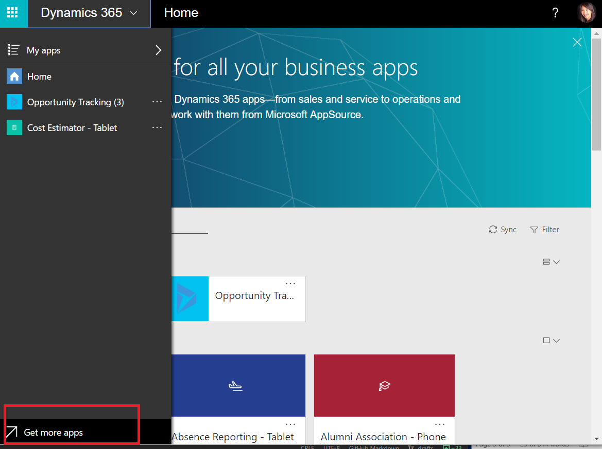

# Suchen nach Apps über AppSource
Die von Ihnen mithilfe von PowerApps erstellten und veröffentlichten Apps werden im Web veröffentlicht und in Dynamics 365 verwendet. Alle Ihre Apps werden angezeigt, d.h. die Apps, für deren Verwendung Sie sich speziell entschieden haben (durch Starten aus einer Freigabe-E-Mail oder durch Öffnen aus AppSource) bzw. die ein Administrator für Sie bereitgestellt hat. Hierzu zählen alle Ihre Apps aus PowerApps, sowie alle Dynamics 365-Anwendungen aus Microsoft. Sie können nach Apps suchen, nach Umgebungen filtern und die am häufigsten verwendeten Apps am oberen Rand der Seite anheften.

  

## Suchen nach Apps über den AppSource-Katalog der Organisation
Microsoft AppSource ist nun auf der Startseite von [Dynamics 365](http://home.dynamics.com) und in die allgemeine Navigation eingebettet. Außerdem ist ein privater Katalog von Apps innerhalb Ihres Unternehmens vorhanden. Wählen Sie auf der Startseite oder im Aufgabenbereich **Weitere Apps abrufen** aus, und navigieren Sie zur Registerkarte **Meine Organisation**, um die für Sie verfügbaren Apps zu durchsuchen.

Apps, die mit PowerApps erstellt und für eine Sicherheitsgruppe oder mit **Benutzerberechtigung** für das gesamte Unternehmen freigegeben wurden, werden hier angezeigt, sodass die Startseite jetzt übersichtlicher ist. Wenn Sie eine App aus AppSource abrufen, wird diese anschließend auf der Startseite angezeigt, und sie ist über die Umgebung ohne Weiteres zugänglich.

  
