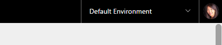
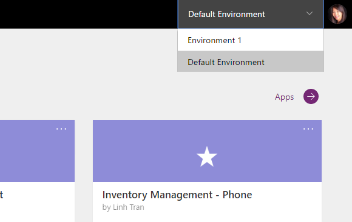
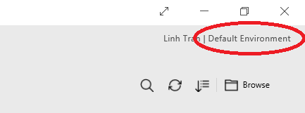
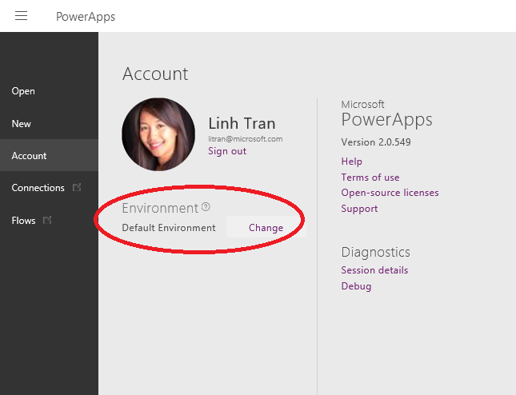
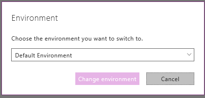
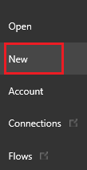

# Arbeiten mit Umgebungen und Microsoft PowerApps
Mit PowerApps können Sie in verschiedenen Umgebungen arbeiten und einfach zwischen ihnen wechseln. Eine Übersicht der Umgebungen finden Sie unter [Umgebungsübersicht](environments-overview.md), wo detailliert erläutert wird, warum Sie Umgebungen verwenden und wie Sie sie erstellen und verwalten können. In diesem Artikel werden die folgenden Themen zu Umgebungen behandelt:

* Wechseln der Umgebung auf powerapps.com
* Erstellen einer App in der richtigen Umgebung
* Anzeigen einer App in der richtigen Umgebung

## Wechseln der Umgebung
Wenn Sie sich registrieren und bei powerapps.com anmelden, landen Sie wahrscheinlich in einer Standardumgebung. Sie können dies mit einem Blick auf die obere rechte Ecke der Seite überprüfen.

Die *Standardumgebung* ist für jedermann zugänglich. Sie können in dieser Umgebung Apps erstellen und Ihre Apps mit anderen Benutzern teilen. Möglicherweise haben Sie auch Zugriff auf andere Umgebungen, etwa solche, die Sie [selbst erstellen](environments-administration.md) oder solche, die von anderen erstellt wurden, auf die Sie aber Zugriff haben. Sie können die Umgebung wechseln, indem Sie auf die Umgebungs-Dropdownliste in der oberen rechten Ecke klicken und eine andere Umgebung auswählen. In diesem Beispiel wechsle ich aus der *Standardumgebung* zu *Umgebung 1*.

Nach dem Wechsel zu einer anderen Umgebung (wie etwa Umgebung 1) sehen Sie alle Apps, die Sie erstellt oder auf die Sie Zugriff haben, in dieser neuen Umgebung.

## Erstellen von Apps in der richtigen Umgebung
Sie können Apps in vorhandenen Umgebungen erstellen, auf die Sie Zugriff haben, oder in einer neuen Umgebung. Das Erstellen einer eigenen Umgebung erfordert jedoch einen spezifischen Plan. Weitere Informationen finden Sie in [diesem Thema](pricing-billing-skus.md). Bevor Sie eine App erstellen, sollten Sie immer **darauf achten, die Umgebung auszuwählen, in der sich die App befinden soll**. Andernfalls müssen Sie sich mit dem Verschieben von Apps zwischen Umgebungen befassen.

1. Wenn Sie sich in [powerapps.com](http://web.powerapps.com) befinden, wählen Sie die Umgebung aus, in der Sie Ihre App erstellen möchten. Wenn Sie sich in *PowerApps Studio* oder *PowerApps Studio für Web* befinden, fahren Sie mit Schritt 4 fort.
2. Wählen Sie **+ Neue App** aus
3. Wählen Sie **PowerApps Studio öffnen** oder **PowerApps Studio für Web** aus
4. Wenn *PowerApps Studio* oder *PowerApps Studio* für Web geöffnet wird, wählen Sie die Umgebung erneut in der oberen rechten Ecke aus. Wir werden dies in Zukunft benutzerfreundlicher gestalten, in der aktuellen Version müssen Sie dies jedoch jedes Mal auswählen, wenn Sie eine App in einer neuen Umgebung erstellen möchten.
   
   
5. Wählen Sie auf der Seite **Konto** den Befehl **Wechseln** neben dem Namen der aktuellen Umgebung aus.
   
   
6. Wählen Sie die Umgebung aus, in der Sie Ihre App erstellen möchten.
   
   
7. Wählen Sie **Neu** aus, um mit dem Erstellen der App zu beginnen. Ihre App befindet sich jetzt in der Umgebung, die Sie in Schritt 6 ausgewählt haben.
   
   

## Anzeigen von Apps in der richtigen Umgebung
Gleich, ob Sie in [powerapps.com](http://web.powerapps.com), PowerApps Studio für Windows oder PowerApps Studio für Web arbeiten, die Liste der Apps, Verbindungen usw., die angezeigt wird, ist immer auf der Grundlage der Umgebung gefiltert, die in der Dropdownliste ausgewählt ist. Wenn Sie die gesuchten Apps nicht sehen, überprüfen Sie immer, ob die richtige Umgebung ausgewählt ist.

Zur Erinnerung – so erfolgt das Wechseln der Umgebung in [powerapps.com](http://web.powerapps.com):

Wechseln der Umgebung in PowerApps Studio für Windows oder PowerApps Studio für Web:

  

Weitere Informationen zu Umgebungen finden Sie in [dieser Übersicht](environments-overview.md).

